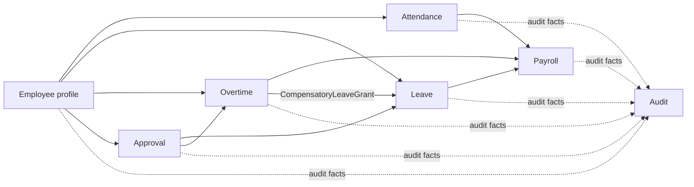

# 需求

## 目的
- 定義 worksync-hr 的高層需求範圍與第一批驗收重點。

## 圖解

## 規則
- 第一批需求必須先保護員工身分、trusted actor、出勤、請假與審批邊界。
- Payroll、permissions、audit 與敏感資料寫入只能走 server-side 控制。
- 不以 generic workflow engine、共用 business service 或過早抽象作為 MVP 前提。
- 跨 Context 一律透過公開契約、query port 或明確 mapping 協作。
- Security 是跨 Context 政策；Audit 是只接收事實、不改寫來源狀態的下游 Context。

## 範例
| 範圍 | 最小驗收 |
| --- | --- |
| Employee | 可提供 employee / membership / capability snapshot 給其他流程使用 |
| Attendance | 可建立與查詢出勤紀錄，並保護重複打卡與異常處理入口 |
| Leave | 可提交、核准、駁回、取消請假申請 |
| Approval | 可解析 approver 與代理責任，不直接改寫請假或加班狀態 |
| Overtime | 可先定義申請與補償邊界，不強迫第一版完成完整計算 |
| Payroll | 只消費已核准或已公開的上游結果，不回寫來源 Context |
| Audit | 可追溯敏感 command、拒絕、override 與匯出，不取代來源 aggregate |

## 維護注意事項
- 範圍調整時同步更新 `roadmap.md`、對應 domain / application 文件與必要的 security 文件。
