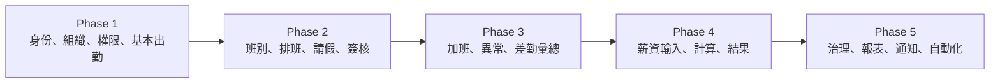

# 系統需求

## Problem
- 建立可分階段開發的完整 1HR 差勤薪資藍圖，並固定資料所有權、跨 Context 契約與敏感操作邊界。

## 系統內範圍
| 能力 | 必要行為 | Owner |
| --- | --- | --- |
| 員工主檔 | 建立、更新、停用員工及必要個資 | Employee |
| 組織與任職 | 組織單位、任職 Membership、主管、Role、Capability | Organization |
| 班別與排班 | Shift、工作日、版本化排班與發布 | Schedule |
| 出勤 | 打卡、異常、校正、結算與差勤摘要 | Attendance |
| 請假 | 假別、申請、額度、核准、取消與已核准摘要 | Leave |
| 加班 | 申請、核准、補償方式與薪資／補休結果 | Overtime |
| 簽核 | 審批責任、代理人、有效期間與責任解析 | Approval |
| 薪資 | 期間、輸入凍結、計算、調整、覆核、結果、薪資單與匯出 | Payroll |
| 稽核 | 敏感異動、讀取、拒絕、override、匯出紀錄 | Audit |
| 通知 | 消費已完成事件並傳送通知、保存投遞狀態 | Notification |
| 安全與檔案 | tenant 隔離、授權、資料分級、附件與匯出保護 | Cross-cutting / adapter |

## 系統外範圍
- 招募、績效、訓練、福利、費用報銷與完整會計總帳。
- 銀行實際撥薪、稅務申報、社會保險申報及特定法域合規判定。
- 租戶計費、訂閱、客製網域與 SaaS 商務後台。
- 未經需求證明的 Event Sourcing、完整 CQRS、Message Broker、Saga、強制 Outbox 或 generic workflow engine。

## 分階段依賴

| Phase | 先決條件 | 可驗收結果 |
| --- | --- | --- |
| 1 | 無 | tenant-safe actor、員工／組織／任職、基本打卡可用 |
| 2 | Phase 1 身份與 Membership | 可發布排班並完成請假與代理審批 |
| 3 | Phase 2 排班與簽核 | 可處理異常、加班並發布結算摘要 |
| 4 | Phase 3 finalized summaries | 可凍結輸入、計算、調整、覆核、發布薪資單 |
| 5 | 前四階段穩定事件與資料分類 | 可稽核查詢、匯出、通知與受控自動化 |

## 全域驗收規則
- 每個 command、query、Repository Port 與 Snapshot 都必須帶可信任 tenant scope。
- Server Action、Route Handler 均視為公開端點，逐次驗證 identity、tenant、capability、resource scope。
- 跨 Context 只使用 Snapshot、Summary、Query Port 或版本化 Integration Event。
- Client Component 不得直接寫入任職／權限、敏感個資、差勤校正、假額度、簽核決策、薪資、稽核或受控匯出。
- 細部法規數值可延後；Context 邊界、資料 owner、狀態轉移與公開契約不得留白。
