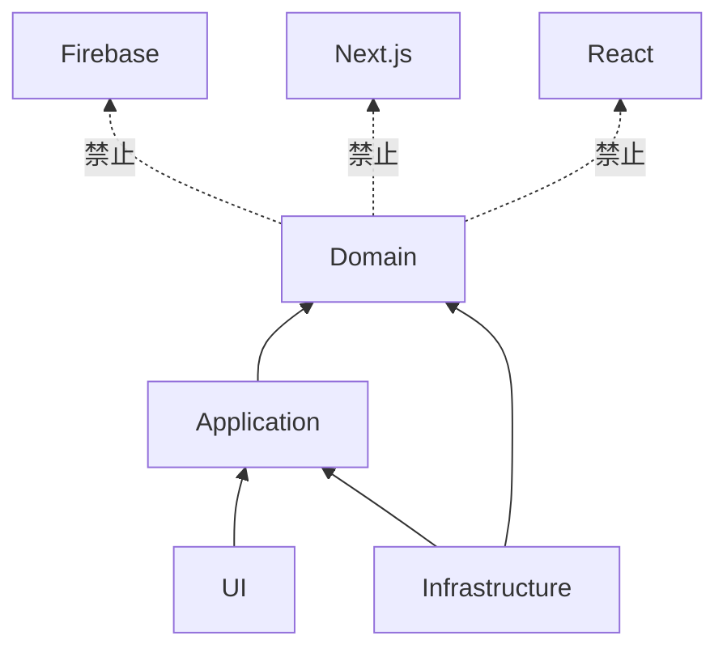

# ADR-0002: 使用 DDD + Hexagonal Architecture

## 狀態
Accepted

## 日期
2026-06-29

## 背景
- 專案同時包含差勤、請假、審批、薪資、稽核等多個業務概念。

## 決策
- 採用 DDD 建模 bounded contexts。
- 採用 Hexagonal Architecture 管理依賴方向。

## 原因
- 有助於隔離業務規則。
- 避免 UI 與 Firebase 直接滲入 domain。
- 讓 use case 與 infrastructure 可獨立演進。
- 有利於文件化與審查。
- 適合逐步擴充模組。

## 取捨
- 優點：邊界清楚、可測試性高、降低耦合。
- 限制：前期文件與命名 discipline 成本較高。

## 後續影響
- 架構需建立清楚的 port 與 adapter 分工。
- 程式碼需禁止 Domain import React、Next.js、Firebase。
- Firebase 相關實作集中於 infrastructure。
- 文件需同步維護 bounded context 與依賴規則。

