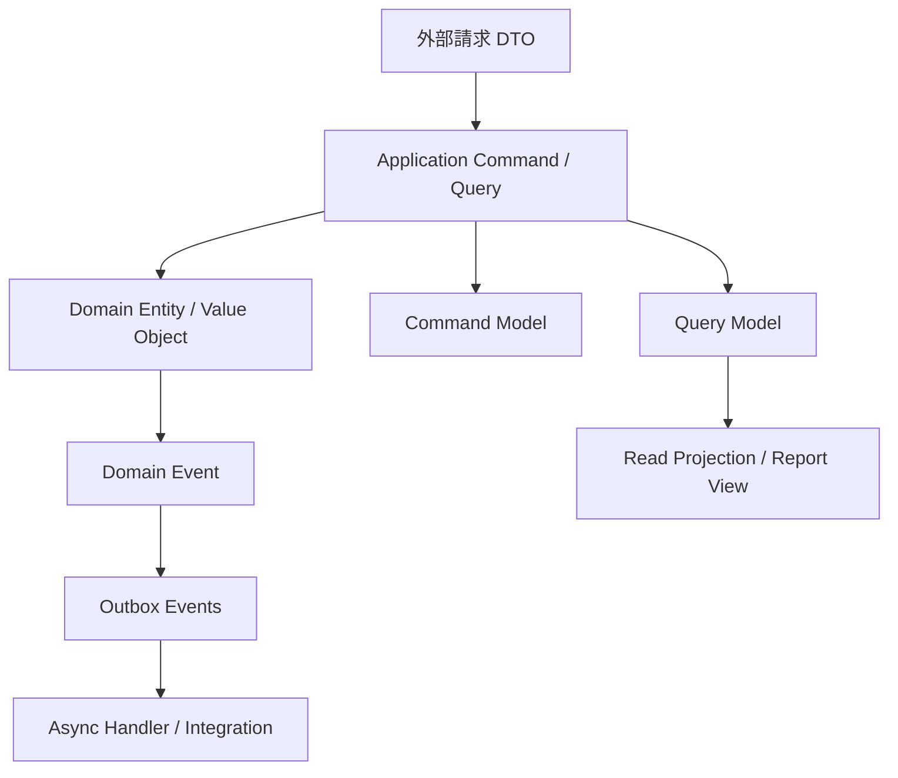

# 進階落地模式 Advanced Patterns

## 目的
- 只在效能、資料隔離、一致性與追溯需求明確時，引入更進階模式。

## Mermaid 圖解

## worksync-hr 套用方式
- DTO 放在 adapter / application 邊界；VO 留在 Domain。
- 薪資報表、差勤統計可逐步導入 CQRS 讀模型。
- Firestore 事件一致性需求可先用 `outbox_events` collection。
- Event Sourcing 不預設採用，只在薪資、法遵、稽核追溯需求明確時評估。

## 規則
- DTO 不等於 Domain Model。
- 不要把 Firestore document shape 當 Domain Entity。
- CQRS 先解決讀寫壓力，再引入複雜度。
- Outbox 與 Event Sourcing 只在需求證明後採用。

## 維護注意事項
- 若進階模式無法說清成本與收益，就先不要用。
- 引入模式時，需同步更新 architecture、domain、application 與 infrastructure 文件。
