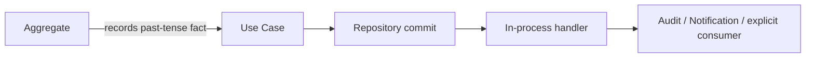

# 進階模式採用門檻

## 目前決策
| 模式 | 狀態 | 原因／重新評估條件 |
| --- | --- | --- |
| DTO／Snapshot／Read Model | 採用 | 明確隔離 adapter、Aggregate 與跨 Context Published Language |
| 完整 CQRS | 不採用 | Query Port 已足夠；只有讀寫負載或模型明顯分離才評估 |
| Event Sourcing | 不採用 | append-only AuditRecord 已滿足追溯；目前不需要事件重建狀態 |
| 強制 Outbox／Message Broker | 不採用 | 先用同程序事件與冪等契約；可靠跨服務投遞需求出現後評估 |
| Saga | 不採用 | 尚無需長時間跨服務補償的流程 |
| Generic workflow engine | 不採用 | Leave、Overtime 各自擁有狀態；Approval 只解析責任 |
| 中央 Business Service／Settings | 不採用 | 規則留在 owner Context，避免隱性耦合與 God Object |

## Domain Event 流程

- 跨 Context event 仍需 `tenantId`、`eventId`、`eventVersion`、`occurredAt` 與冪等 consumer。
- Notification 在 commit 後執行；失敗不回滾來源業務狀態。
