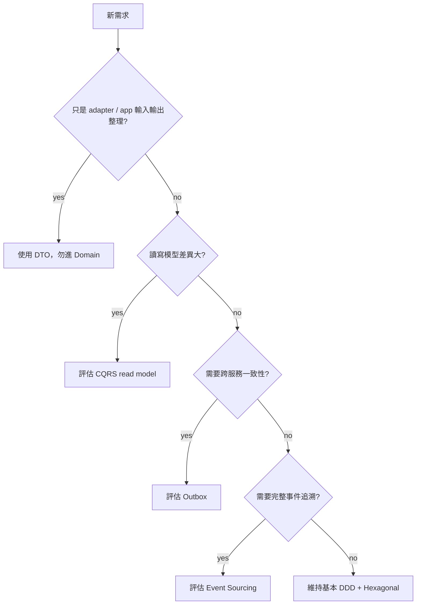

# 進階落地模式 Advanced Patterns

## 目的
- 只在需求明確時導入 DTO / CQRS / Outbox / Event Sourcing。

## 決策圖

## 採用規則
| 模式 | 何時考慮 | 不要做什麼 |
| --- | --- | --- |
| DTO | adapter / use case 邊界需要輸入輸出模型 | 不要把 DTO 當 VO |
| CQRS | 查詢投影與寫模型差異很大 | 不要為了潮流預設拆讀寫 |
| Outbox | 事件發布與資料異動需一致 | 不要先做分散式複雜方案 |
| Event Sourcing | 法遵、薪資、稽核追溯需求高度明確 | 不要在需求未定時導入 |

## 文件規則
- 新模式採用前，先更新 canonical docs。
- 只有重大、耐久、難逆轉決策才寫 ADR。
