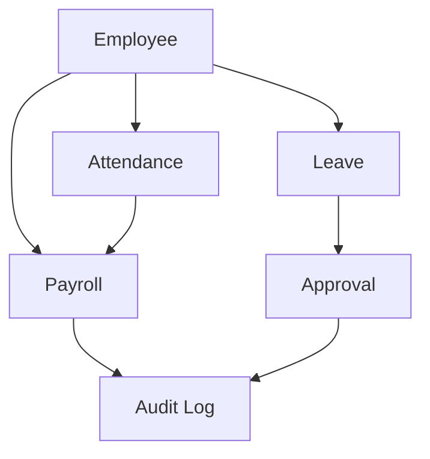

# Bounded Contexts

## 目的
- 定義核心業務邊界與主要關聯。

## 圖解

## 規則
- Context 之間以 use case 或 domain event 協調。
- 跨 context 欄位共享要經明確 mapping。

## 範例
- Payroll 讀取 Attendance 與 Leave 的已核准結果，不直接改寫其內部規則。

## 維護注意事項
- 新增 context 時先更新關聯圖。
