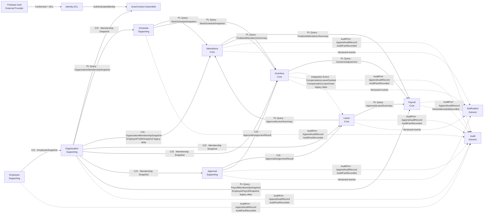

# Bounded Contexts 與 Context Map

## Problem
- 固定十個 Context 的語言、資料所有權、公開契約與上下游關係，避免跨域共用 Aggregate 或 Firestore document。

## Context Map
箭頭由上游真相來源指向下游消費者；虛線為同程序 Domain／Integration Event 或治理關係。

## Context 責任矩陣
| Context | 負責／不負責 | Aggregate | 主要 Value Object | 主要 Domain Event | 公開 Snapshot／Summary | Repository／Query Port |
| --- | --- | --- | --- | --- | --- | --- |
| `Employee` | 員工主檔；不負責任職、權限、登入 | `Employee`（Aggregate Root） | `EmployeeId`, `EmployeeStatus`, `PersonalProfile` | `EmployeeHired`, `EmployeeProfileUpdated`, `EmployeeDeactivated` | `EmployeeSnapshot` | `EmployeeRepository`, `EmployeeSnapshotQueryPort` |
| `Organization` | tenant 組織、Membership、主管、Role、Capability；不負責員工個資 | `OrganizationUnit`, `Membership` | `TenantId`, `Role`, `Capability`, `EmploymentPeriod` | `OrganizationUnitCreated`, `MembershipAssigned`, `CapabilityGranted` | `OrganizationMembershipSnapshot`, `PayrollMembershipSnapshot` | `OrganizationUnitRepository`, `MembershipRepository`, 對應 Query Ports |
| `Schedule` | Shift、WorkSchedule、WorkDay 與版本化規則；不負責 Punch | `Shift`, `WorkSchedule` | `ShiftTimeRange`, `WorkDay`, `ScheduleVersion` | `ShiftDefined`, `WorkSchedulePublished`, `WorkScheduleRevised` | `WorkScheduleSnapshot` | `ShiftRepository`, `WorkScheduleRepository`, `WorkScheduleSnapshotQueryPort` |
| `Attendance` | Punch、AttendanceException、校正、結算；不負責排班與薪資 | `AttendanceRecord` | `Punch`, `WorkDate`, `AttendanceException`, `CorrectionReason` | `PunchRecorded`, `AttendanceExceptionDetected`, `AttendanceFinalized` | `FinalizedAttendanceSummary` | `AttendanceRecordRepository`, `AttendanceSummaryQueryPort` |
| `Leave` | LeaveType、LeaveRequest、LeaveBalance；不負責 approver 真相 | `LeaveType`, `LeaveRequest`, `LeaveBalance` | `LeavePeriod`, `LeaveUnit`, `LeaveStatus` | `LeaveRequestSubmitted`, `LeaveRequestApproved`, `LeaveBalanceAdjusted` | `ApprovedLeaveSummary`, `LeaveBalanceSummary` | 三個 Repository 與對應 Query Ports |
| `Overtime` | 申請、核定與 CompensationMode；不負責薪資計算 | `OvertimeRequest` | `OvertimePeriod`, `CompensationMode`, `OvertimeStatus` | `OvertimeRequestApproved`, `OvertimeCompensationPublished` | `OvertimeAdjustment` | `OvertimeRequestRepository`, `OvertimeAdjustmentQueryPort` |
| `Approval` | approver、delegate、assignment、有效期；不改寫 Leave／Overtime | `ApprovalAssignment` | `Approver`, `Delegate`, `ApprovalTargetRef` | `ApprovalAssigned`, `ApprovalDelegated`, `ApprovalDecisionRecorded` | `ApprovalAssignmentResult` | `ApprovalAssignmentRepository`, `ApprovalAssignmentQueryPort` |
| `Payroll` | 期間、輸入、結果、調整、薪資單；不擁有上游資料或實際撥薪 | `PayrollPeriod`, `PayrollResult` | `PayrollInput`, `PayrollAdjustment`, `Money`, `PayrollInputVersion` | `PayrollInputsFrozen`, `PayrollCalculated`, `PayrollResultsPublished` | `PayrollResultSummary`, `SalarySlipView` | `PayrollPeriodRepository`, `PayrollResultRepository`, `PayrollResultQueryPort` |
| `Audit` | append-only 稽核、查詢、匯出；不做授權或修改來源狀態 | `AuditRecord` | `AuditAction`, `AuditResult`, `TargetRef` | `AuditRecordAppended` | `AuditRecordView` | `AuditStorePort`, `AuditRecordQueryPort` |
| `Notification` | delivery、重試、狀態；不決定或回滾業務結果 | `NotificationDelivery` | `NotificationChannel`, `Recipient`, `DeliveryStatus` | `NotificationDelivered`, `NotificationDeliveryFailed` | `NotificationStatusSummary` | `NotificationDeliveryRepository`, `NotificationStatusQueryPort`, `NotificationGatewayPort` |

## 公開契約目錄與相容別名
| Canonical contract | Deprecated compatibility alias | 說明 |
| --- | --- | --- |
| `OrganizationMembershipSnapshot` | `EmployeeProfileSnapshot` | 舊檢查器相容；新程式不得新增使用 |
| `PayrollMembershipSnapshot` | `EmployeePayrollSnapshot` | 舊檢查器相容；Payroll 使用 canonical 名稱 |
| `CompensatoryLeaveGranted` | `CompensatoryLeaveGrant` | 舊事件名稱只供文件檢查相容 |
| `AppendAuditRecord` | 無 | `AuditPort` 的 application input，不是 Aggregate |
| `AuditFactRecorded` | 無 | 已記錄的 audit fact；不代表採用 Outbox |

## 公開契約最小欄位
| 契約 | 必要欄位 |
| --- | --- |
| `AuthenticatedIdentity` | `subjectId`, `provider`, `authenticatedAt` |
| `ActorContext` | `tenantId`, `employeeId`, `membershipId`, `capabilities`, `scope`, `requestId`, `requestSource` |
| `EmployeeSnapshot` | `tenantId`, `employeeId`, `status`, `displayName`, `version` |
| `OrganizationMembershipSnapshot` | `tenantId`, `membershipId`, `employeeId`, `organizationUnitId`, `managerMembershipId?`, `roles`, `capabilities`, `status`, `version` |
| `WorkScheduleSnapshot` | `tenantId`, `employeeId`, `dateRange`, `workDays`, `scheduleVersion` |
| `ApprovedLeaveSummary` | `tenantId`, `leaveRequestId`, `employeeId`, `leaveTypeId`, `period`, `approvedAt`, `version` |
| `FinalizedAttendanceSummary` | `tenantId`, `attendanceRecordId`, `employeeId`, `workDate`, `regularMinutes`, `exceptionMinutes`, `version` |
| `ApprovalAssignmentResult` | `tenantId`, `assignmentId`, `targetRef`, `approverMembershipId`, `delegateMembershipId?`, `status`, `validUntil?`, `version` |
| `OvertimeAdjustment` | `tenantId`, `overtimeRequestId`, `employeeId`, `approvedMinutes`, `compensationMode`, `version` |
| `PayrollResultSummary` | `tenantId`, `payrollPeriodId`, `payrollResultId`, `employeeId`, `currency`, `gross`, `deductions`, `net`, `version` |

## 協作規則
- Producer 擁有真相與版本；Consumer 不得透過 Repository 讀寫他域 Aggregate。
- Query Port 回傳不可變 Published Language；下游可保存 input snapshot，但不得宣稱擁有上游資料。
- Integration Event 必須包含 `tenantId`、`eventId`、`eventVersion`、`occurredAt`，consumer 依 `eventId` 冪等。
- Domain Event 先採同程序派送；不預設 broker、Outbox、Saga 或 Event Sourcing。
- 敏感 mutation 的成功 Audit fact 與來源寫入應在同一 Firestore transaction／batch 完成，Firebase transaction 型別不得進入核心。
- Notification 在來源 commit 後執行；通知失敗只改變 `NotificationDelivery`，不得回滾來源 Aggregate。
- Security 是全域 policy；System Settings、page、slot、route group、collection 都不是 Context。
