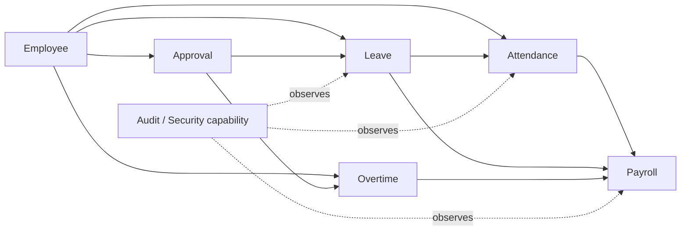

# Bounded Contexts

## 目的
- 定義核心業務邊界、上下游關係與哪些能力只是 cross-cutting capability。

## 圖解

## 規則
- `Employee` 擁有員工、membership、角色與 capability 的來源語意。
- `Approval` 解析 approver、delegate 與責任分派，不擁有請假、加班或薪資狀態機。
- `Payroll` 只消費已公開的 Attendance / Leave / Overtime 結果，不直接回寫上游。
- `Audit / Security` 是 cross-cutting capability；記錄事實與權限治理，但不取代核心 Domain。
- Context 間只用 query port、integration event、ACL 或明確 application contract 協作。

## 範例
- `Leave` 可依賴 `Employee` 提供的 membership / capability snapshot，但不能直接共享 Employee aggregate 內部狀態。

## 維護注意事項
- 新增 Context、改名或調整責任時，先更新此圖、詞彙表與必要的 domain / application 文件。
