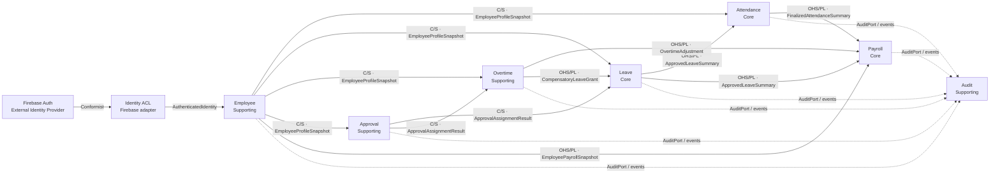

# Bounded Contexts 與 Context Map

## 目的
- 定義每個模型邊界的責任、資料所有權、公開契約與上下游關係。
- 本文件是 Bounded Context 清單、Context Map 與跨 Context 契約的唯一真相來源。

## Context Map
箭頭由上游真相來源指向下游消費者；虛線表示非同步事件或 audit append。

## 責任與資料所有權
| Context | 擁有的模型與資料 | 對外責任 | 不負責的事項 |
| --- | --- | --- | --- |
| `Employee` | `Employee`、`Membership`、組織與 capability snapshot | 發布有效員工、任職與 payroll snapshot | 登入驗證、打卡、請假、薪資計算 |
| `Attendance` | `AttendanceRecord`、punch、異常與校正 | 發布 finalized attendance summary | 權限來源、請假審批、薪資結果 |
| `Leave` | `LeaveRequest`、假別期間、額度異動與決策紀錄 | 發布 approved leave summary；接收補休 grant | approver 真相、原始 punch、薪資發放 |
| `Overtime` | `OvertimeRequest`、補償決策 | 發布 payroll adjustment 或 compensatory leave grant | 原始 punch、approver 真相、薪資主檔 |
| `Approval` | `ApprovalAssignment`、delegate 與 escalation | 回傳誰有責任審批；記錄 assignment 生命周期 | Leave／Overtime aggregate 的核准狀態 |
| `Payroll` | `PayrollPeriod`、`SalarySlip`、input snapshot | 收斂已公開的上游結果並發布薪資 | 回寫 Employee、Attendance、Leave、Overtime 原始資料 |
| `Audit` | append-only `AuditRecord` | 保存敏感操作、拒絕、override 與匯出事實 | 授權決策、取代來源 aggregate、修改業務狀態 |

Security 是跨 Context 政策，不是此清單中的模型邊界。Firebase Auth 是外部 Generic Provider，不擁有 Employee 或 Membership。

## 公開契約目錄
| Producer | Consumer | Pattern | 契約 | 方式 | 真相來源 | 失敗與一致性 |
| --- | --- | --- | --- | --- | --- | --- |
| Firebase Auth | Employee adapter | Conformist + ACL | `AuthenticatedIdentity` | 同步 | Firebase Auth | 驗證失敗即拒絕；SDK 型別不得進入核心 |
| Employee | Attendance、Leave、Overtime、Approval | Customer/Supplier | `EmployeeProfileSnapshot` | 同步 query port | Employee | 查無有效 membership 即拒絕 use case |
| Employee | Payroll | OHS / Published Language | `EmployeePayrollSnapshot` | 同步 query port | Employee | snapshot 必帶版本；執行期間不得靜默換版 |
| Approval | Leave、Overtime | Customer/Supplier | `ApprovalAssignmentResult` | 同步 query port | Approval | 無 approver 或 assignment 過期即拒絕送審／決策 |
| Leave | Attendance、Payroll | OHS / Published Language | `ApprovedLeaveSummary` | 同步 query port | Leave | 只公開 Approved；消費者不得讀取 Leave aggregate |
| Attendance | Payroll | OHS / Published Language | `FinalizedAttendanceSummary` | 同步 query port | Attendance | 非 Finalized 結果不得進入 payroll input |
| Overtime | Payroll | OHS / Published Language | `OvertimeAdjustment` | 同步 query port | Overtime | 只公開已核定薪資補償；重複版本必須冪等 |
| Overtime | Leave | OHS / Published Language | `CompensatoryLeaveGrant` | 非同步 integration event | Overtime | 至少一次投遞；Leave 依 event ID 冪等處理 |
| 各業務 Context | Audit | Customer/Supplier | `AppendAuditRecord`／`AuditFactRecorded` | 同步 port 或 outbox event | 來源 Context | mutation 與 local outbox 原子提交；Audit 冪等重試。敏感 read／denied audit 同步失敗即整體失敗 |

## Published Language 最小欄位
所有契約都是不可變 application DTO，不是 Entity 或 Firestore document。

| 契約 | 必要欄位 |
| --- | --- |
| `AuthenticatedIdentity` | `subjectId`, `provider`, `authenticatedAt` |
| `EmployeeProfileSnapshot` | `employeeId`, `membershipId`, `employmentStatus`, `departmentId`, `managerId`, `capabilities`, `version` |
| `EmployeePayrollSnapshot` | `employeeId`, `employmentStatus`, `payrollScope`, `version` |
| `ApprovalAssignmentResult` | `assignmentId`, `targetRef`, `approverId`, `delegateId?`, `status`, `validUntil?` |
| `ApprovedLeaveSummary` | `leaveRequestId`, `employeeId`, `leaveType`, `period`, `approvedAt`, `version` |
| `FinalizedAttendanceSummary` | `attendanceRecordId`, `employeeId`, `workDate`, `regularMinutes`, `exceptionMinutes`, `version` |
| `OvertimeAdjustment` | `overtimeRequestId`, `employeeId`, `payrollMinutes`, `compensationMode`, `version` |
| `CompensatoryLeaveGrant` | `eventId`, `overtimeRequestId`, `employeeId`, `grantedMinutes`, `occurredAt` |
| `AppendAuditRecord` | `actorId`, `action`, `targetRef`, `result`, `reason?`, `requestSource`, `occurredAt` |
| `AuditFactRecorded` | `eventId`, `eventVersion`, `actorId`, `action`, `targetRef`, `result`, `requestSource`, `occurredAt` |

## 協作規則
- Context 間不得直接 import 他域 aggregate、entity 或 Firestore document。
- Query port 回傳 Published Language；integration event 使用過去式名稱並包含 `eventId`、`occurredAt`。
- 下游可保存具版本的 input snapshot，但真相與修改權仍留在上游。
- 同步依賴必須有 timeout／error mapping；非同步 consumer 必須可重試且冪等。
- 有業務 mutation 的 audit fact 必須與來源 Aggregate 寫入同一個 local transaction／outbox；Audit Context 不參與來源交易。
- Security guard 位於 server-side adapter 與 application policy，不得用 Context Map 箭頭假裝成業務資料流。

## 與 UI 的關係
| UI 概念 | 說明 |
| --- | --- |
| `page` | 使用者入口，不是 use case |
| `slot` | UI composition，不是 bounded context |
| `route group` | 導覽與 layout 分群，不是 subdomain |
| `dashboard` | 可組合多個 Context 的 read model，但不能擁有其業務規則 |
