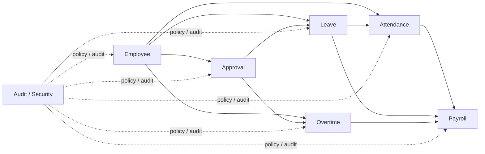

# Bounded Contexts

## 目的
- 定義各 Context 的責任、不負責事項、上下游與協作方式。

## Context Map

## 責任矩陣
| Context | 責任範圍 | 不負責的事項 |
| --- | --- | --- |
| `Employee` | 員工主檔、membership、角色與 capability snapshot | 打卡、請假、薪資計算 |
| `Attendance` | 出勤紀錄、異常、結算狀態 | 權限來源、薪資最終計算 |
| `Leave` | 請假申請、額度消耗、狀態流 | approver 真相、薪資發放 |
| `Overtime` | 加班申請、補償模式、公開調整結果 | 原始 punch 真相、薪資主檔 |
| `Approval` | approver / delegate 解析、責任指派 | 請假或加班 aggregate 內部狀態 |
| `Payroll` | 計薪期間、輸入收斂、薪資結果 | 上游原始 document 擁有權 |
| `Audit / Security` | 稽核、讀寫治理、匯出治理 | 取代任何核心 Domain 的狀態機 |

## 協作規則
- Context 間只透過 query port、公開 summary、integration event 或 ACL 協作。
- 不得直接 import 他域 aggregate、entity、Firestore document。
- 下游可快取 snapshot，但真相仍留在上游 Context。

## 與 UI 的關係
| UI 概念 | 說明 |
| --- | --- |
| `page` | 使用者入口，不是 use case |
| `slot` | UI composition，不是 bounded context |
| `route group` | 導覽與 layout 分群，不是 subdomain |
| `dashboard` | 可同時組合多個 Context read model |
