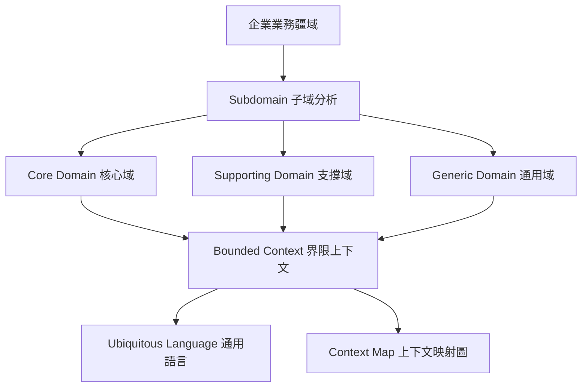
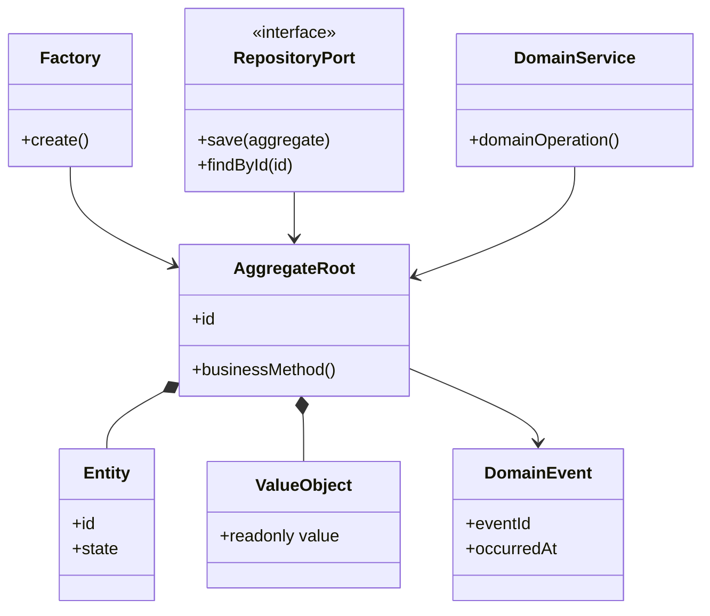
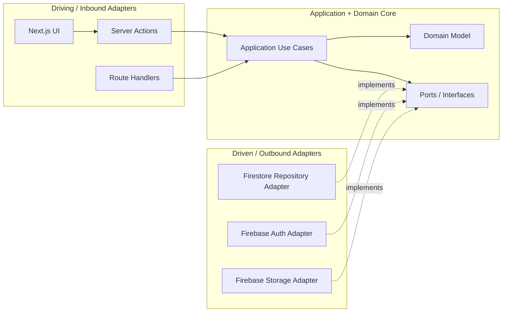
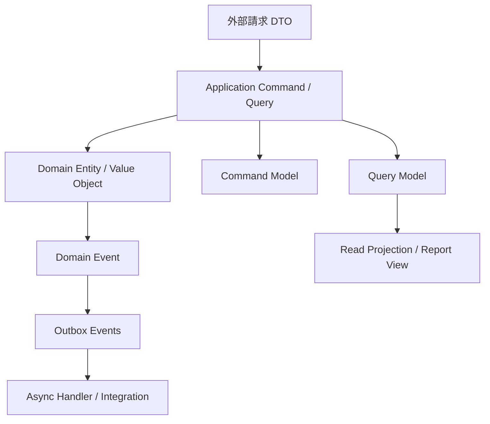
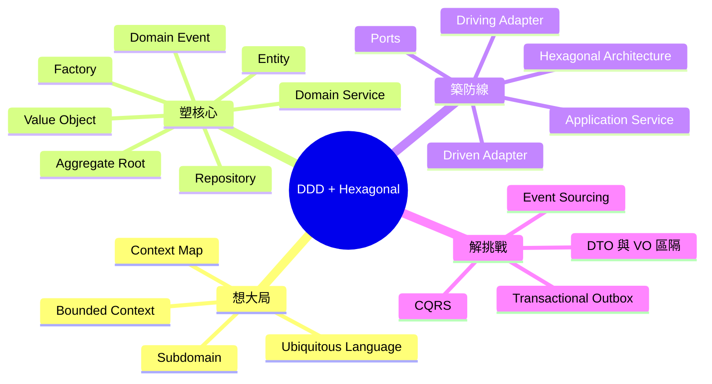

# DDD 與六邊形架構設計流程

## 第一階段：戰略設計 Strategic Design

目的：在寫程式碼之前，看清企業業務疆域、業務邊界與團隊溝通語言。

1. **Subdomain 子域**
   - 分析企業總體業務疆域。
   - 區分核心域、支撐域、通用域。
   - 確立資源投入優先順序。
2. **Bounded Context 界限上下文**
   - 根據業務邊界或團隊架構，劃分模型邊界。
   - 每個 Context 內部使用自己的模型與語言。
3. **Ubiquitous Language 通用語言**
   - 在特定界限上下文內，團隊與業務專家共同建立無歧義術語。
   - 文件、程式命名、測試案例都應使用相同語言。
4. **Context Map 上下文映射圖**
   - 繪製不同界限上下文之間的上游 / 下游關係。
   - 說明技術協同模式與依賴方向。

## 第二階段：戰術設計 Tactical Design

目的：在單一界限上下文內，將通用語言具象化為純粹的業務模型，不含任何技術框架。

1. **Value Object 值物件**
   - 描述屬性。
   - 不可變。
   - 無生命週期。
   - 以值相等判斷。
2. **Entity 實體**
   - 有唯一 ID。
   - 狀態會隨生命週期改變。
   - 以 ID 判斷同一性。
3. **Aggregate Root 聚合根**
   - 將相關 Entity 與 Value Object 包裝成一致性邊界。
   - 外部只能透過聚合根操作內部物件。
   - 作為資料持久化的單位。
4. **Domain Service 領域服務**
   - 承載無法歸屬於單一 Entity 或 Aggregate 的業務邏輯。
   - 應保持無狀態。
   - 不處理技術細節。
5. **Domain Event 領域事件**
   - 表示業務專家關心且已經發生的重要事實。
   - 用於非同步解耦、稽核、後續流程觸發。
6. **Factory 與 Repository**
   - Factory：建立複雜 Aggregate。
   - Repository：定義操作 Aggregate 持久化的抽象介面。
   - Repository 只定義介面，不實作 Firebase。

## 第三階段：架構設計 Architecture

目的：使用 Hexagonal Architecture / Ports & Adapters 保護領域核心，阻絕 UI、HTTP、Firebase、資料庫等外部技術污染 Domain。

1. **Hexagonal Architecture / Ports & Adapters**
   - 外圍技術與核心業務完全解耦。
   - Domain 不知道 Firebase、Next.js、React。
2. **Ports 輸入 / 輸出埠**
   - Inbound Port：外部呼叫核心的入口。
   - Outbound Port：核心需要外部能力時定義的介面。
3. **Application Service / Use Case**
   - 負責流程編排。
   - 不放業務規則。
   - 只依賴 Domain 與 Ports。
4. **Driving / Inbound Adapters**
   - 外部入口。
   - 例如 Next.js Server Actions、Route Handlers、UI Controller。
5. **Driven / Outbound Adapters**
   - 實作核心定義的 Outbound Port。
   - 例如 Firestore Repository、Firebase Auth Adapter、Storage Adapter。

## 第四階段：進階落地模式 Advanced Patterns

目的：在系統面臨高效能、資料隔離、分散式一致性需求時，引入更進階的工程模式。

1. **DTO 與 VO 的區隔**
   - DTO 放在外層。
   - Value Object 放在 Domain。
   - DTO 不等於 Domain Model。
   - 不要把 Firestore document shape 直接當 Domain Entity。
2. **CQRS**
   - Command 處理寫入與業務規則。
   - Query 處理查詢與投影。
   - 薪資報表、差勤統計可逐步引入讀模型。
3. **Transactional Outbox Pattern**
   - 用於確保資料異動與事件發布的一致性。
   - Firebase / Firestore 場景可先以 `outbox_events` collection 作為簡化版本。
4. **Event Sourcing**
   - 不直接儲存目前狀態，而是保存事件歷史。
   - 初期不預設採用。
   - 只在薪資、稽核、法遵追溯需求明確時評估。

## 執行思維導圖

想大局 → 塑核心 → 築防線 → 解挑戰

