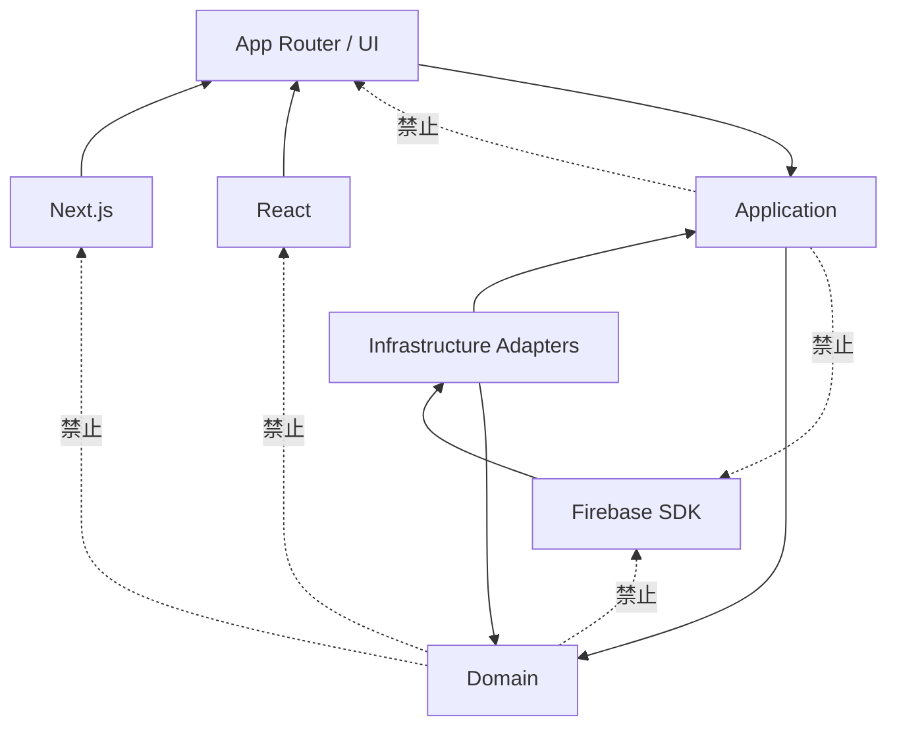

# 依賴規則

## 目的
- 明確標示允許與禁止的依賴方向，保護 DDD + Hexagonal 邊界。

## 圖解

## 規則
- Domain 不可依賴 Firebase、Next.js、React 或 client-side 型別。
- Application 只依賴 Domain 與 core-owned ports，不可直呼 Firebase SDK。
- UI / App Router 屬 adapter；不能反向決定 Domain 模型與持久化結構。
- Context 間不得直接匯入他域 aggregate 或 persistence document。

## Parallel Routes 與 DDD 邊界

- 後台主應用區可預設使用 Parallel Routes，但 slot 僅屬 UI composition。
- Slot 不等於 Bounded Context。
- Route group 不等於 Subdomain。
- Page 不等於 Use Case。
- UI layout 不可決定 Domain model。
- 每個 named slot 應提供 `default.tsx`，避免 routing fallback 破壞 UI 體驗，但此規則不改變核心依賴方向。

## 範例
- `RunPayroll` 可以依賴 `PayrollRepository`、`AttendanceSummaryQueryPort`，不可以直接 import Firestore SDK 或 `src/app/**`。

## 維護注意事項
- 發現跨層 import 時，優先修正邊界或補 port，不擴大允許依賴。
