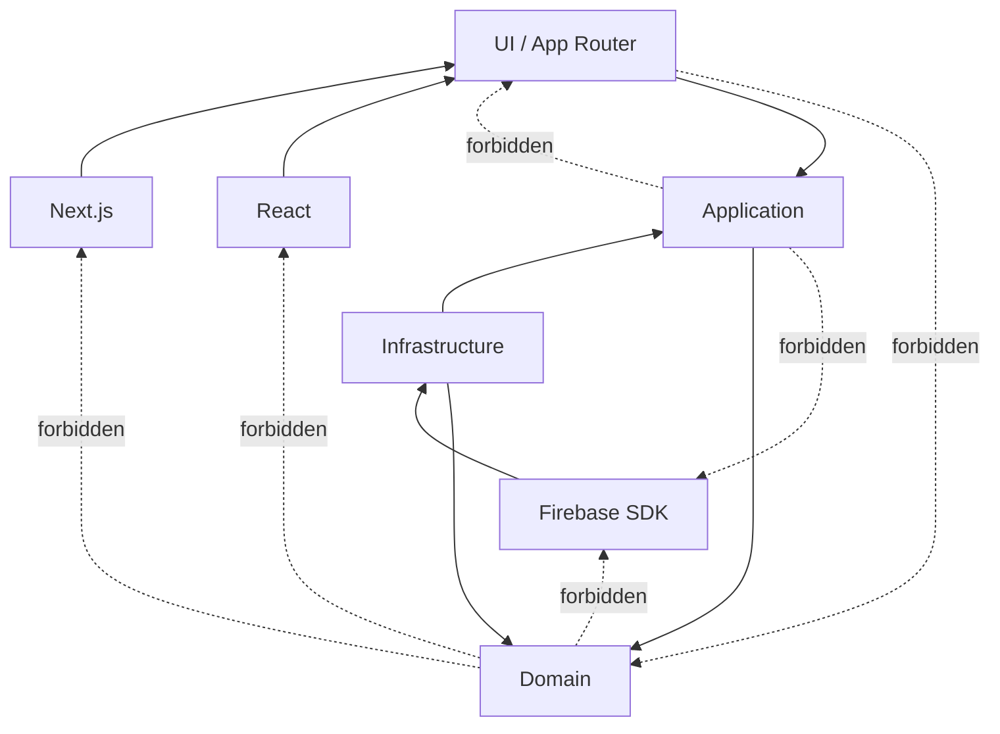

# 依賴規則 Dependency Rule

## 目的
- 明確標示哪些依賴允許、哪些一律禁止。

## Allowed / Forbidden

## 不可違反規則
| 規則 | 說明 |
| --- | --- |
| Domain 不依賴技術框架 | 禁止 React、Next.js、Firebase SDK、瀏覽器 API |
| Application 不直呼 SDK | 一律透過 port |
| UI 不反向決定 Domain | page / slot / form 結構不能變成 domain truth |
| Context 不共享 persistence model | 禁止直接 import 他域 document / aggregate |
| Sensitive write server-only | 薪資、權限、稽核、敏感個資寫入只能 server-side |

## 檢查清單
- 這個型別是不是 Firestore document？若是，不可進 Domain。
- 這個方法是不是 use case orchestration？若不是，不要塞進 Application。
- 這個 client 行為是否直接寫 sensitive data？若是，必須改成 server-side flow。
