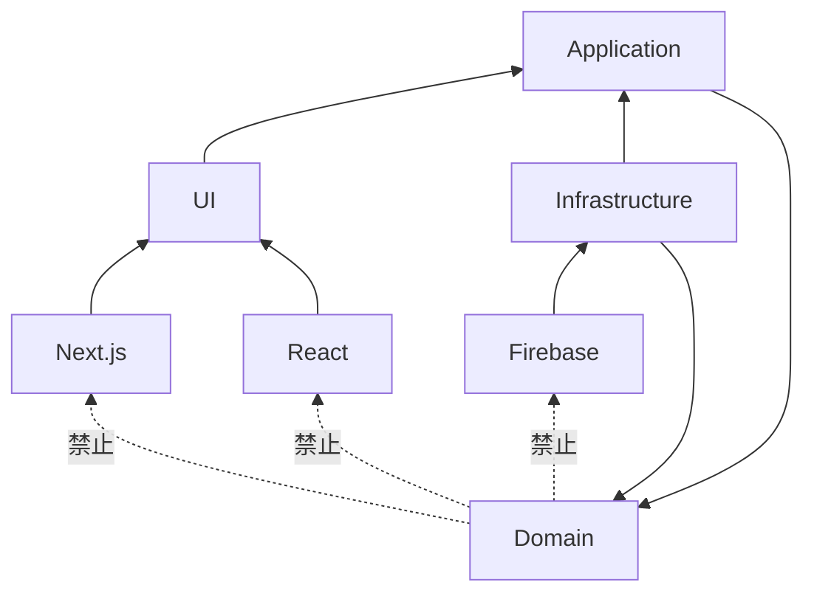

# 依賴規則

## 目的
- 明確標示允許與禁止的依賴方向。

## 圖解

## 規則
- Domain 不可依賴 Firebase / Next.js / React。
- Application 只依賴 Domain 與 Ports。

## 範例
- `ClockIn` use case 可依賴 `AttendanceRecordRepository` port，不可直接 import Firestore SDK。

## 維護注意事項
- 發現跨層 import 時，優先修正邊界而非擴大依賴。
