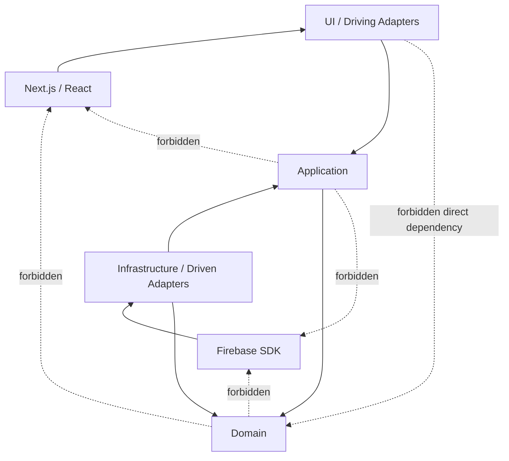

# 依賴規則 Dependency Rule

## Allowed / Forbidden

## 規則
| 邊界 | 必須 | 禁止 |
| --- | --- | --- |
| Domain | 純 TypeScript 業務模型 | React、Next.js、Firebase、browser API |
| Application | Use Case、Port、DTO、Actor policy | SDK、document shape、UI state |
| UI / Adapter | input validation、authn/authz、error mapping | 直接存取 Repository 或改變 Aggregate |
| Infrastructure | mapper、Firebase adapter、transaction composition | 把 Firebase 型別傳入核心 |
| Cross-context | Snapshot、Summary、Query Port、Integration Event | 他域 Aggregate、Repository、document import |
| Tenant | 從 `ActorContext` 傳入每個 port | 信任 URL、form、header 中未驗證的 tenant |

## Sensitive write
- 任職／權限、敏感個資、差勤校正、假額度、簽核決策、Payroll、Audit、受控匯出只能經 server-side Use Case。
- Client Security Rules 是縱深防禦，不取代 Admin SDK 路徑上的 Application 授權。
