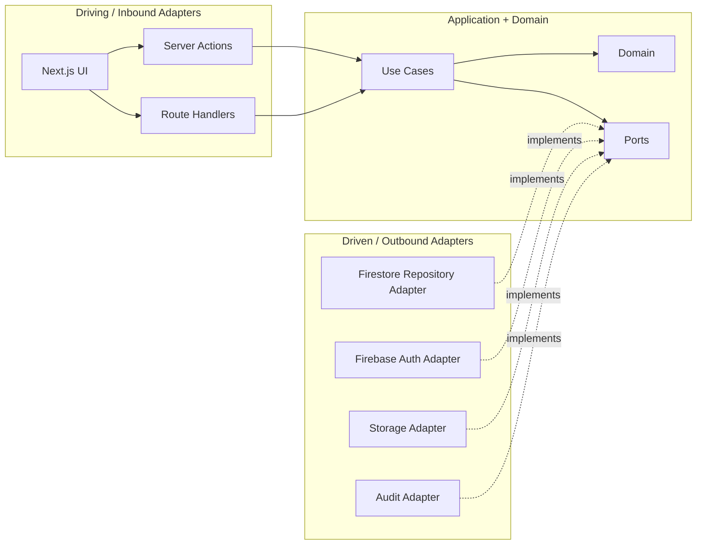

# 六邊形架構 Hexagonal Architecture

## 目的
- 用 Ports & Adapters 隔離 UI、HTTP、Firebase 與核心業務。

## 架構圖

## Port 分類
| 類型 | 目的 | 範例 |
| --- | --- | --- |
| Inbound | 進入核心的 use case contract | `SubmitLeaveRequest`, `StartPayrollRun` |
| Repository Port | Aggregate 持久化抽象 | `LeaveRequestRepository` |
| Query Port | 公開 snapshot / read model | `AttendanceSummaryQueryPort` |
| Service Port | 時鐘、actor、audit、storage | `TrustedActorContextPort`, `AuditPort` |

## Adapter 規則
- Server Action / Route Handler 負責輸入驗證、trusted actor context、錯誤轉譯。
- Firebase adapter 負責 SDK 呼叫、mapper、重試 / 失敗轉譯。
- UI 只依賴 use case 與 read model，不碰 repository 實作。

## Parallel Routes 與 DDD 邊界
| 主題 | 規則 |
| --- | --- |
| Parallel Routes | 僅是 UI composition pattern |
| named slot | 只切畫面，不切 Domain model |
| `default.tsx` | 處理 fallback，不改變核心邊界 |
| Intercepting Routes | 用於 modal deep link，不可繞過 use case |
