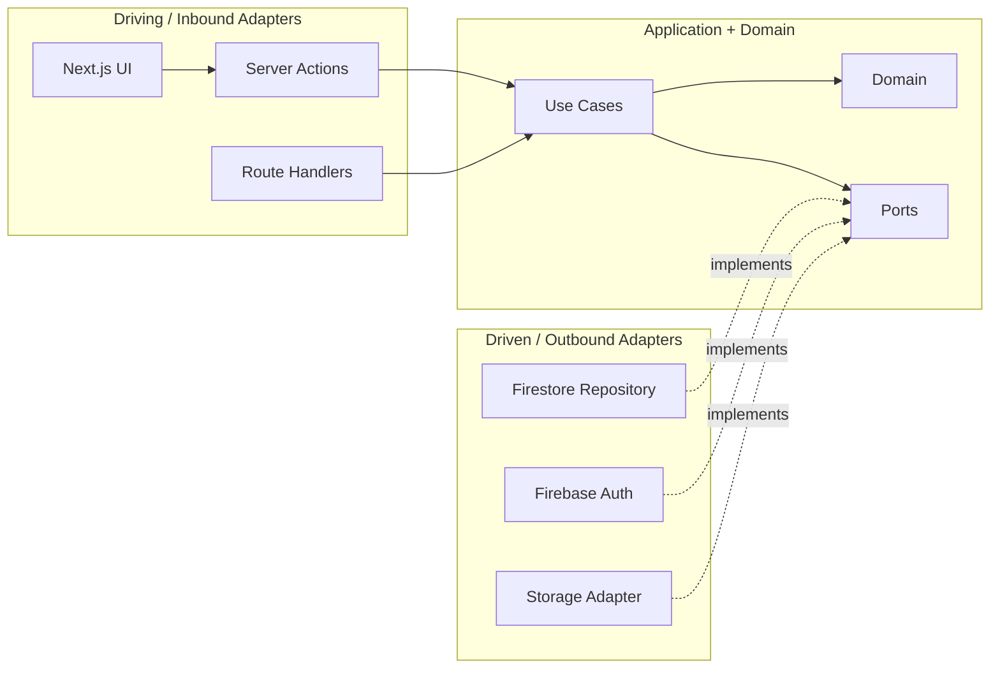

# 六邊形架構 Hexagonal Architecture

## 目的
- 用 Ports & Adapters 保護 Application 與 Domain 核心，隔離 Next.js、Firebase、HTTP 與 UI。

## Mermaid 圖解

## worksync-hr 套用方式
- UI 層使用 App Router、Server Actions、Route Handlers、shadcn/ui。
- Application layer 只負責 use case orchestration、權限入口、port 協調。
- Infrastructure layer 才能實作 Firestore repository、Auth adapter、Storage adapter、mapper。

## 規則
- Domain 不可知道 React、Next.js、Firebase SDK。
- Application 只依賴 Domain 與 ports。
- Driving Adapter 呼叫 Inbound Port；Driven Adapter 實作 Outbound Port。
- 敏感寫入必須經 server-side trusted actor context。

## 維護注意事項
- 新增整合前先判斷是否需要新 port。
- 若只是換技術供應者，不要讓 adapter 洩漏型別進核心。
