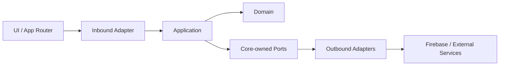

# 六邊形架構

## 目的
- 說明 UI、Application、Domain、Ports、Adapters 的責任與技術邊界。

## 圖解

## 規則
| 區域 | 責任 | 禁止 |
| --- | --- | --- |
| Domain | Entity、Value Object、Domain rule、狀態轉移 | React、Next.js、Firebase SDK、HTTP |
| Application | Use case、授權入口、transaction、port 協調 | 具體 adapter、頁面元件、client state |
| Inbound Adapter | DTO 驗證、trusted actor context、error mapping | 偷藏 business rule、直接寫 DB |
| Outbound Adapter | Repository、query、auth、storage、mapper、技術錯誤轉譯 | 洩漏 Firebase 型別進核心 |

## 範例
- Firestore repository 是 outbound adapter；`AttendanceRecordRepository` 才是核心定義的 port。

## 維護注意事項
- 新增整合時先確認是否需要新的 port；若只是現有 port 的另一種實作，不要新增多餘 abstraction。
