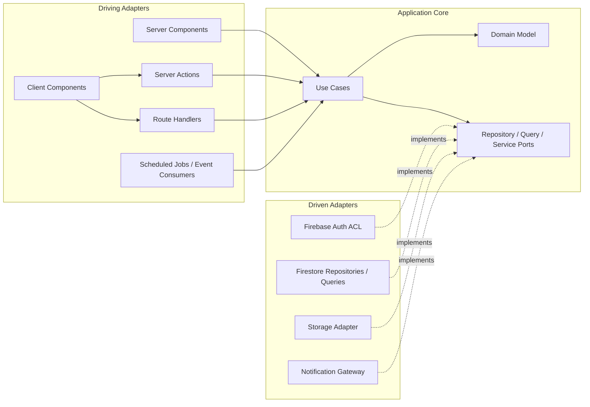

# 六邊形架構 Hexagonal Architecture

## 依賴與呼叫方向

## Layer 責任
| Layer | 負責 | 不負責 |
| --- | --- | --- |
| Domain | Aggregate 不變條件、VO、Domain Service、Domain Event | I/O、授權 token、Firebase、Next.js、React |
| Application | Use Case orchestration、tenant/capability policy、Port、transaction intent | UI state、SDK 呼叫、Firestore document mapping |
| Driving Adapter | 驗證輸入、驗證 identity、建立 `ActorContext`、錯誤轉譯 | 業務規則或直接呼叫 repository |
| Driven Adapter | 實作 Repository／Query／Service Port、重試與外部錯誤轉譯 | 改寫 Domain 規則 |
| Infrastructure | Firebase 初始化、mapper、transaction composition、composition root | 對外暴露 SDK 型別 |

## Server 入口
- Server Actions 與 Route Handlers 都視為公開端點；每次呼叫都驗證 identity、`TenantId`、Capability 與 resource scope。
- Server Action 適合 UI form mutation；Route Handler 適合 HTTP API、webhook、下載與外部整合。
- Server Component 可呼叫 query use case；Client Component 只能送最小 input，不能提供可信任 role、capability 或 tenant。
- Scheduled Job／event consumer 也必須建立 system `ActorContext` 與 tenant scope。

## Firebase 與 Mapper
- Firebase Web／Admin SDK 只可出現在 Infrastructure 或明確 server adapter。
- Admin SDK 會繞過 Firestore Security Rules；server-side Application policy 仍須授權與驗證 tenant。
- `document -> mapper -> Aggregate/Read Model`；`Aggregate -> mapper -> write document`。
- Mapper 處理 Timestamp、null、版本、遮罩、document ID 與 tenant path；Firestore document 永遠不等於 Domain Entity。

## Port 命名
| 類型 | 規則 | 範例 |
| --- | --- | --- |
| Repository | `<AggregateRoot>Repository` | `WorkScheduleRepository` |
| Query | `<PublishedLanguage>QueryPort` | `WorkScheduleSnapshotQueryPort` |
| Service | `<Capability>Port` | `ClockPort`, `AuditPort`, `NotificationGatewayPort` |
