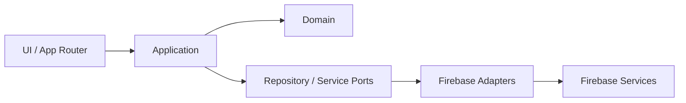

# 六邊形架構

## 目的
- 說明 UI、Application、Domain、Ports、Adapters 的位置。

## 圖解

## 規則
- Use case 依賴 port，不依賴 adapter。
- Adapter 可依賴 Firebase SDK，但 Domain / Application 不可。

## 範例
- Firestore repository 是 adapter，不是 domain repository 定義本身。

## 維護注意事項
- 若新增外部系統，先補 port 再補 adapter。
