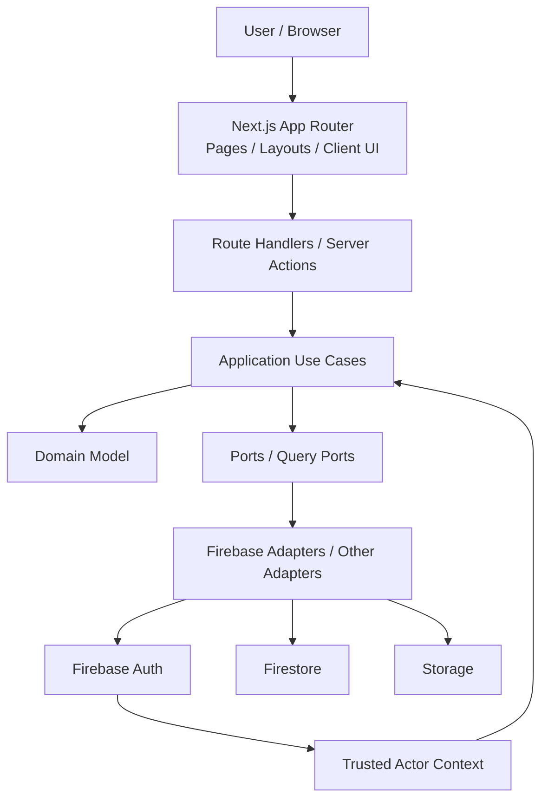

# 架構總覽

## 目的
- 快速說明 worksync-hr 的主要層次、Firebase 角色與敏感資料邊界。

## 圖解

## 規則
- UI 與 Adapter 依賴核心；核心不依賴 Next.js、React、Firebase SDK。
- Firebase Auth 只證明 identity；角色、membership、capability 需由 server-side actor context 解析。
- Firestore document、Storage metadata 與 Domain entity 必須經 mapper 轉換。
- Payroll、permissions、audit 等敏感流程不得由 Client Component 直接寫入。

## 範例
- 送出請假時，UI 只送出必要輸入；Server Action 建立 trusted actor context，再呼叫 `SubmitLeaveRequest`。

## 維護注意事項
- 新增外部服務、公開契約或跨 Context 資料流時，先更新此圖與對應規則文件。
