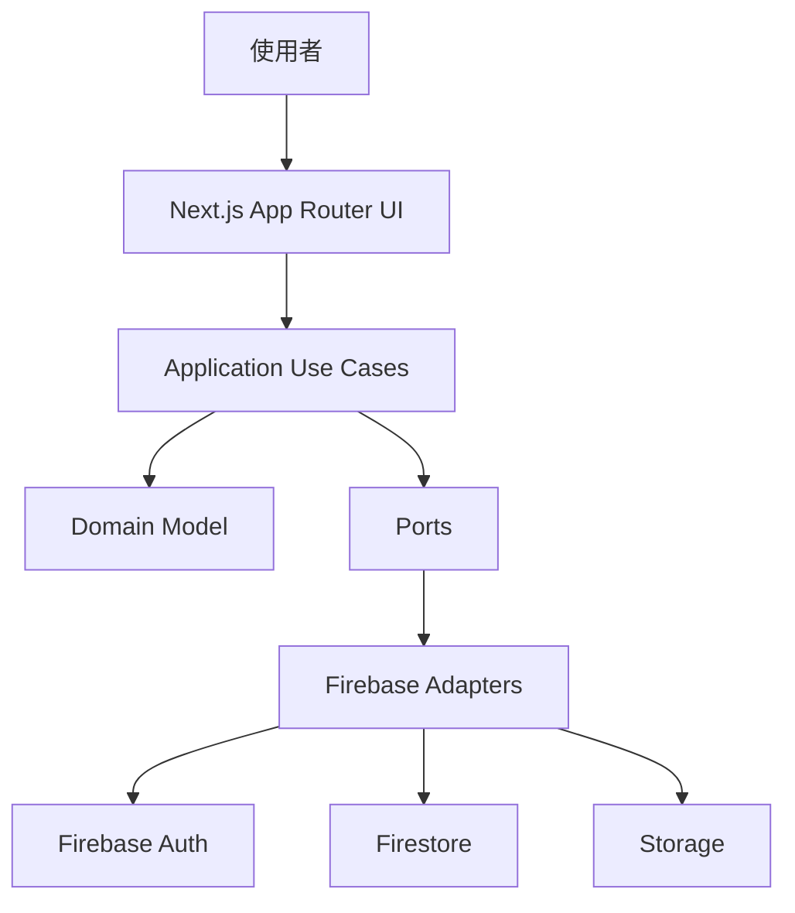

# 架構總覽

## 目的
- 快速說明系統主要層次與外部服務。

## 圖解

```mermaid
flowchart TD
  U[使用者] --> UI[Next.js App Router UI]
  UI --> APP[Application Use Cases]
  APP --> DOM[Domain Model]
  APP --> PORTS[Ports]
  PORTS --> FIRE[Firebase Adapters]
  FIRE --> AUTH[Firebase Auth]
  FIRE --> FS[Firestore]
  FIRE --> ST[Storage]
```

## 規則
- Domain 保持框架無關。
- Firebase 只透過 adapter 進出。

## 範例
- 請假申請由 UI 觸發 use case，再經 port 存取 Firestore。

## 維護注意事項
- 外部服務若新增，先更新此圖。
