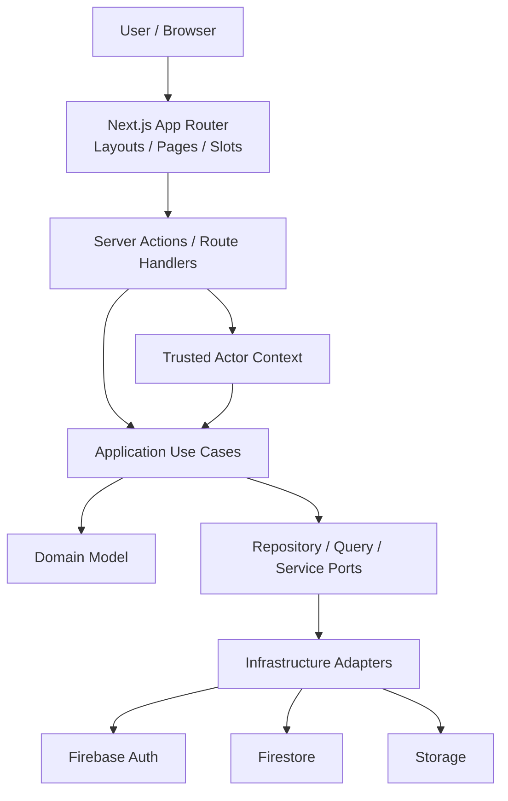

# 架構總覽

## 目的
- 快速對齊多租戶 1HR 的十個 Context、層次責任、Firebase 位置與敏感資料限制。

## 系統視圖

## 架構原則
| 主題 | 規則 |
| --- | --- |
| Domain | 不可 import React、Next.js、Firebase SDK |
| Application | 只做 use case orchestration，不持有 UI state、document shape |
| Infrastructure | 實作 Firebase adapters、mapper、rules 對齊 |
| Frontend | 預設 Server Component；Client Component 只負責互動狀態 |
| Security | 薪資、權限、稽核、敏感個資不可由 Client Component 直接寫入 |
| Tenant | `TenantId` 只能由 server-side ActorContext 取得並貫穿所有 Port |

## DDD 分層對應 `src` 目錄建議
| Layer | 建議目錄 | 說明 |
| --- | --- | --- |
| Domain | `src/domain/<context>/` | Aggregate、Entity、VO、Domain Service、Domain Event |
| Application | `src/application/<context>/` | Use Case、Command / Query DTO、Ports |
| Infrastructure | `src/infrastructure/firebase/<context>/` | Firestore repository、Auth adapter、Storage adapter、mapper |
| UI / Adapter | `src/app/**`、`src/components/**` | App Router、layouts、slots、Server Actions、Route Handlers |

## 邊界提醒
- `page` 不等於 use case。
- `slot` 不等於 bounded context。
- `route group` 不等於 subdomain。
- Firestore document 不等於 Domain Entity。
- Server Actions 與 Route Handlers 都視為公開端點；Admin SDK 不以 Security Rules 取代授權。

## 文件真相來源
| 問題 | canonical doc |
| --- | --- |
| Context 邊界 | `bounded-contexts.md` |
| 分層與 ports | `hexagonal-architecture.md`、`dependency-rule.md` |
| Aggregate / VO | `tactical-design.md`、`docs/02-domain/*` |
| Subdomain 分類 | `strategic-design.md` |
| Context Map／公開契約 | `bounded-contexts.md` |
| Firebase schema / rules | `docs/04-infrastructure/*` |
| UI routing / slots | `docs/05-frontend/app-router.md` |
| 權限 / 資料分級 / audit | `docs/07-security/*` |
