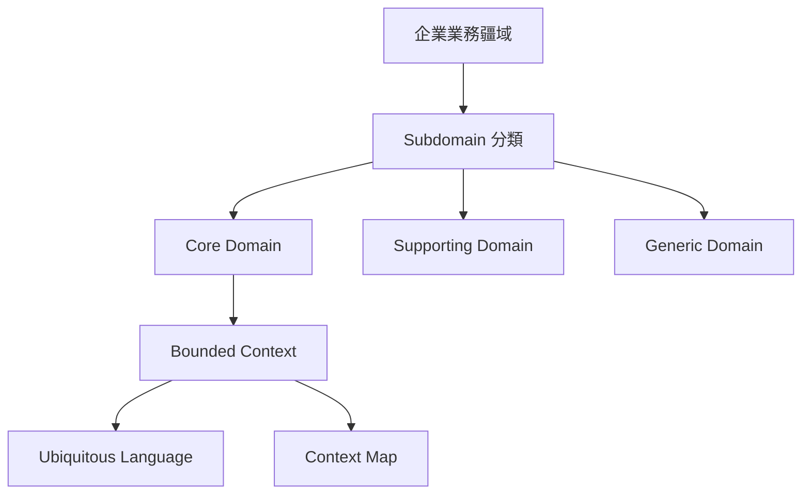

# 戰略設計 Strategic Design

## 目的
- 先看整體業務疆域，再切出 worksync-hr 的核心邊界與語言。

## Mermaid 圖解

## worksync-hr 套用方式
- `Employee`、`Attendance`、`Leave`、`Overtime`、`Approval`、`Payroll` 是主要 bounded contexts。
- `Audit / Security` 為 cross-cutting capability，治理權限與稽核，不直接取代核心 Domain。
- 先對齊 `docs/00-project/glossary.md` 與 `bounded-contexts.md` 再命名程式。

## 規則
- 先確認 Subdomain，再切 Bounded Context。
- 同一個 Context 內只使用一套通用語言。
- 跨 Context 協作要先說清上游 / 下游與依賴方向。

## 維護注意事項
- 新增核心功能前，先補詞彙、邊界與 context map。
- 若只是 UI 分頁變更，不要反向改寫 Domain 邊界。
