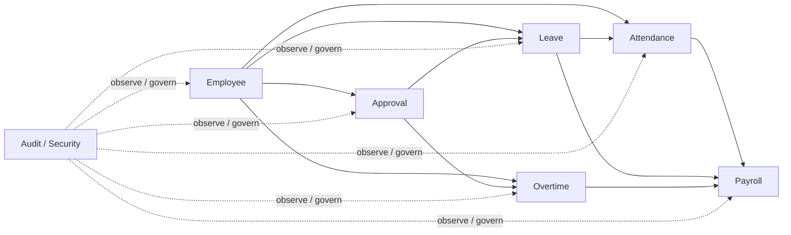

# 戰略設計 Strategic Design

## 目的
- 先切清業務疆域、bounded contexts 與跨 Context 依賴，再進入 tactical design。

## Subdomain 分類
| 類型 | Context |
| --- | --- |
| Core Domain | `Attendance`、`Leave`、`Payroll` |
| Supporting Domain | `Employee`、`Overtime`、`Approval` |
| Cross-cutting capability | `Audit / Security` |

## Context Map

## 上下游關係
| Upstream | Downstream | 協作方式 |
| --- | --- | --- |
| `Employee` | `Attendance`、`Leave`、`Overtime`、`Approval`、`Payroll` | membership / capability snapshot、query port |
| `Approval` | `Leave`、`Overtime` | approver resolution、assignment result |
| `Leave` | `Attendance`、`Payroll` | approved leave result、period summary |
| `Attendance` | `Payroll` | attendance summary / finalized result |
| `Overtime` | `Payroll` | overtime adjustment / compensation result |
| `Audit / Security` | 全域 | audit event、policy guard、read/export governance |

## 命名規則
- Context 內使用單一 Ubiquitous Language。
- 跨 Context 只公開 snapshot、summary、assignment、result 等明確契約。
- 不用 UI 名稱替代 Domain 名稱，例如 `PayrollPageData` 不能取代 `PayrollPeriod`。

## 決策節點
| 問題 | 先看什麼 |
| --- | --- |
| 新功能屬哪個 Context | `docs/00-project/glossary.md`、`bounded-contexts.md` |
| 需要新 Context 嗎 | 是否出現獨立語言、生命週期、一致性邊界 |
| 只是 UI 分頁嗎 | 優先看 `docs/05-frontend/app-router.md`，不要誤切 Domain |
