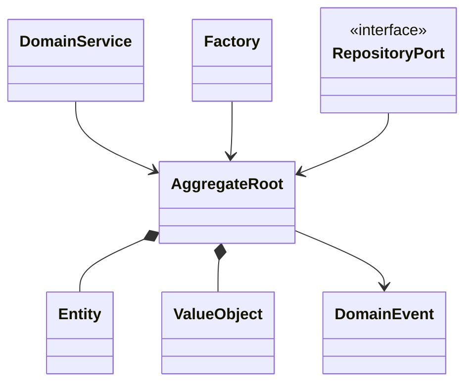

# 戰術設計 Tactical Design

## 目的
- 將 strategic design 收斂成 Aggregate、Entity、Value Object、Domain Event 與 Repository Port。

## Tactical building blocks

## `src` 對應建議
| 概念 | 建議目錄 | 備註 |
| --- | --- | --- |
| Aggregate / Entity / VO | `src/domain/<context>/` | 純業務規則，不含 Firebase / Next.js |
| Command / Query contract | `src/application/<context>/` | 可含 application DTO，但不是 document shape |
| Repository Port | `src/application/<context>/ports/` 或 `src/domain/<context>/ports/` | 視 port owner 決定，但只放介面 |
| Mapper / Adapter | `src/infrastructure/firebase/<context>/` | document ↔ domain / read model |

## 候選模型速查
| Context | Aggregate Root 候選 | Entity / VO 候選 |
| --- | --- | --- |
| Employee | `Employee`、`Membership` | `EmploymentStatus`、`CapabilitySet` |
| Attendance | `AttendanceRecord` | `Punch`、`WorkDate`、`CorrectionReason` |
| Leave | `LeaveRequest` | `LeavePeriod`、`LeaveType`、`LeaveBalanceSnapshot` |
| Overtime | `OvertimeRequest` | `OvertimePeriod`、`CompensationMode` |
| Approval | `ApprovalAssignment` | `ApproverScope`、`DelegateWindow` |
| Payroll | `PayrollPeriod`、`SalarySlip` | `Money`、`PayrollInputVersion` |
| Audit | `AuditRecord` | `AuditAction`、`AuditResult` |

## 不可犯錯
- 不要把 Firestore document shape 當成 Aggregate。
- 不要讓 Client Component 決定狀態轉移。
- 不要把跨 Context 查詢邏輯塞進 Domain Entity。
