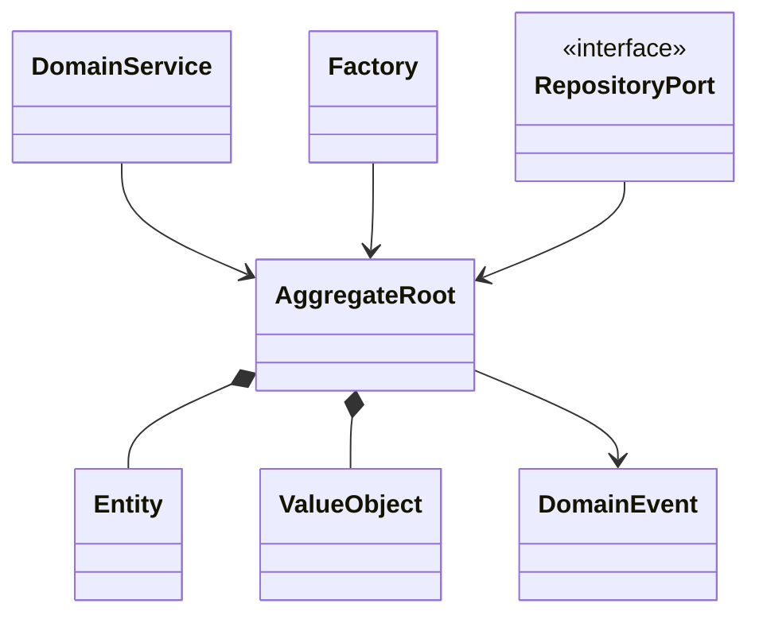

# 戰術設計 Tactical Design

## 目的
- 將 strategic design 收斂成 Aggregate、Entity、Value Object、Domain Event 與 Repository Port。

## Tactical building blocks

## `src` 對應建議
| 概念 | 建議目錄 | 備註 |
| --- | --- | --- |
| Aggregate / Entity / VO | `src/domain/<context>/` | 純業務規則，不含 Firebase / Next.js |
| Command / Query contract | `src/application/<context>/` | 可含 application DTO，但不是 document shape |
| Repository Port | `src/application/<context>/ports/` | Application 擁有持久化需求；Domain 不依賴 port 或 adapter |
| Mapper / Adapter | `src/infrastructure/firebase/<context>/` | document ↔ domain / read model |

## 已確認模型速查
| Context | Aggregate Root | Entity / Value Object |
| --- | --- | --- |
| Employee | `Employee`、`Membership` | `EmploymentStatus`、`CapabilitySet` |
| Attendance | `AttendanceRecord` | `Punch`、`WorkDate`、`CorrectionReason` |
| Leave | `LeaveRequest`、`LeaveBalanceLedger` | `LeaveDecisionRecord`、`LeavePeriod`、`LeaveType` |
| Overtime | `OvertimeRequest` | `OvertimePeriod`、`CompensationMode` |
| Approval | `ApprovalAssignment` | `ApproverScope`、`DelegateWindow` |
| Payroll | `PayrollPeriod`、`SalarySlip` | `PayrollLine`、`Money`、`PayrollInputVersion` |
| Audit | `AuditRecord` | `AuditAction`、`AuditResult` |

## Repository Ports
| Aggregate Root | Repository Port |
| --- | --- |
| `Employee` | `EmployeeRepository` |
| `Membership` | `MembershipRepository` |
| `AttendanceRecord` | `AttendanceRecordRepository` |
| `LeaveRequest` | `LeaveRequestRepository` |
| `LeaveBalanceLedger` | `LeaveBalanceLedgerRepository` |
| `ApprovalAssignment` | `ApprovalAssignmentRepository` |
| `OvertimeRequest` | `OvertimeRequestRepository` |
| `PayrollPeriod` | `PayrollPeriodRepository` |
| `SalarySlip` | `SalarySlipRepository` |
| `AuditRecord` | append-only `AuditPort`，不提供一般 update repository |

## 不可犯錯
- 不要把 Firestore document shape 當成 Aggregate。
- 不要讓 Client Component 決定狀態轉移。
- 不要把跨 Context 查詢邏輯塞進 Domain Entity。
