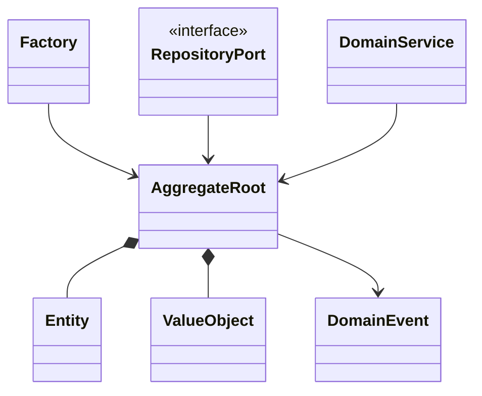

# 戰術設計 Tactical Design

## 目的
- 把通用語言收斂成純業務模型，不讓框架型別污染 Domain。

## Mermaid 圖解

## worksync-hr 套用方式
- `Value Object` 用於日期區間、工時、身份快照等不可變概念。
- `Entity / Aggregate Root` 管理請假單、出勤紀錄、計薪期間等生命週期。
- `Repository` 只在核心定義介面，Firebase 實作留在 infrastructure。

## 規則
- Value Object 必須不可變，且以值相等判斷。
- Entity 必須有唯一識別與清楚的狀態轉移。
- Aggregate Root 是一致性邊界，外部不可繞過它改內部狀態。
- Domain Service 只放無法歸屬於單一 Aggregate 的業務規則。

## 維護注意事項
- 新增欄位前先判斷它是 VO、Entity 還是 DTO。
- 不要把 Firestore document shape 直接當 Domain model。
