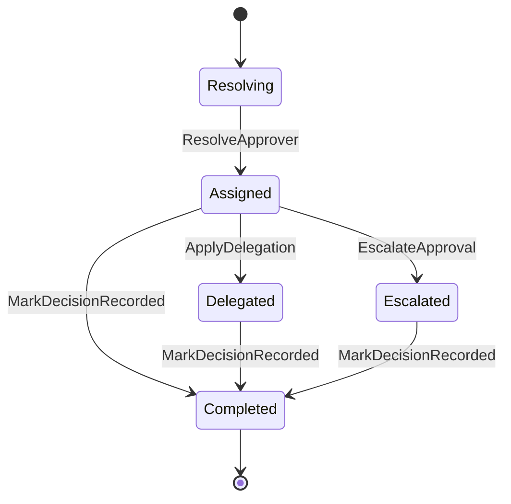

# Approval Domain

## 責任範圍
- approver 解析、delegate、生效期間、責任指派。
- 對外提供誰應該審與目前指派狀態。

## 不負責的事項
- 請假 / 加班 aggregate 內部狀態。
- 薪資與出勤結算。
- 員工主檔真相來源。

## Aggregate / Entity / Value Object 候選
| 類型 | 候選 |
| --- | --- |
| Aggregate | `ApprovalAssignment` |
| Entity | `DelegationRule`, `ApprovalStep` |
| Value Object | `ApproverScope`, `DelegateWindow`, `ApprovalTargetRef`, `AssignmentStatus` |

## 主要狀態機

## Domain Event 候選
- `ApproverResolved`
- `ApprovalAssigned`
- `ApprovalDelegated`
- `ApprovalEscalated`
- `ApprovalDecisionRecorded`

## 與其他 Context 的協作
| 對象 | 協作方式 |
| --- | --- |
| `Employee` | 取得角色、主管、scope |
| `Leave` | 回傳誰該審，不直接改 leave status |
| `Overtime` | 回傳誰該審，不直接改 overtime status |
| `Audit / Security` | 記錄代理、升級、override 路徑 |
