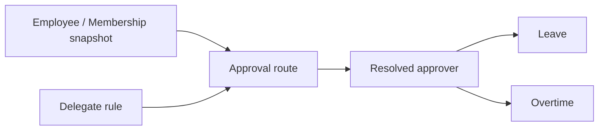

# Approval Domain

## 目的
- 定義 approver 解析、delegate 與責任分派的邊界。

## 圖解

## 規則
- Approval 只回答「現在應由誰審」，不直接改寫請假或加班 aggregate。
- approver resolution 需依角色、scope、代理規則與有效期間判定。
- 找不到有效 approver 時必須回穩定失敗，而不是由 UI 或 client 自行猜測。

## 範例
- Manager 不在當前 scope 時，系統應解析到替代 approver 或回傳明確錯誤。

## 維護注意事項
- 若要加入多層簽核、代理失效或路徑版本化，先補 contract 與 security 影響。
