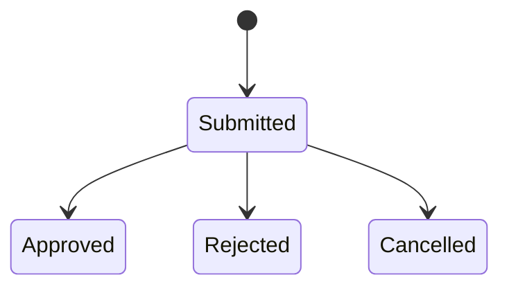

# Approval Domain

## 目的
- 定義通用審批流程。

## 圖解

```mermaid
stateDiagram-v2
  [*] --> Submitted
  Submitted --> Approved
  Submitted --> Rejected
  Submitted --> Cancelled
```

## 規則
- ApprovalRequest 需記錄申請者、審批者、目標資源。
- 審批結果應可回寫對應 bounded context。

## 範例
- 請假申請核准後，LeaveRequest 狀態改為 Approved。

## 維護注意事項
- 避免把每種流程寫成互不相容的審批模型。
