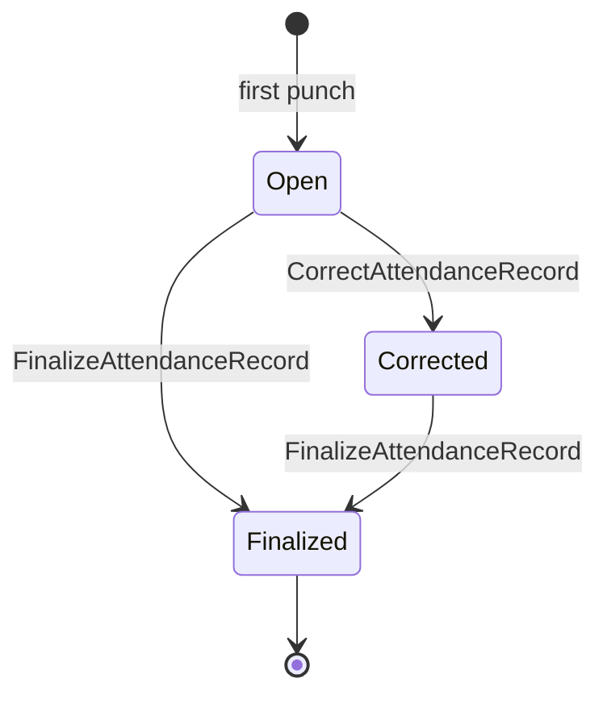

# Attendance Domain

## 目的
- 定義打卡、工作日出勤紀錄、異常與結算邊界。

## 圖解

## 規則
- `AttendanceRecord` 以員工 + 工作日作為核心一致性邊界。
- 同一時間不得存在互相衝突的進行中打卡狀態。
- 補登、校正、請假套用與結算都必須經 domain 規則，而非直接改 document。
- 已結算紀錄不得任意回到可編輯狀態。

## 範例
- 重複 `clock in`、缺少必要 punch 或對 finalized record 再次修改，都應被拒絕。

## 維護注意事項
- 排班、多段上下班、跨日班與加班初算屬延伸規則，新增前先補文件決策。
