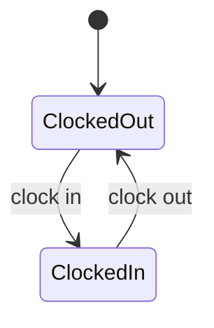

# Attendance Domain

## 目的
- 定義打卡與出勤紀錄核心狀態。

## 圖解

```mermaid
stateDiagram-v2
  [*] --> ClockedOut
  ClockedOut --> ClockedIn: clock in
  ClockedIn --> ClockedOut: clock out
```

## 規則
- 同一員工在同一時間只能有一筆進行中的打卡。
- 異常打卡需進入補登或審核流程。

## 範例
- 重複 clock in 應被拒絕。

## 維護注意事項
- 將排班、地點等延伸規則獨立擴充。
