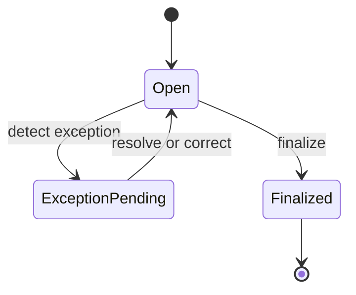

# Attendance Domain

## 邊界
| 負責 | 不負責 |
| --- | --- |
| Punch、AttendanceRecord、AttendanceException、校正、結算 | 定義 Shift／WorkSchedule、請假審批、加班補償、薪資計算 |

## 模型
| 類型 | 模型 |
| --- | --- |
| Aggregate | `AttendanceRecord`（tenant + employee + work date） |
| Entity / VO | `Punch`, `AttendanceException`, `WorkDate`, `WorkInterval`, `CorrectionReason` |
| Domain Event | `PunchRecorded`, `AttendanceExceptionDetected`, `AttendanceCorrected`, `AttendanceFinalized` |
| Public contract | `FinalizedAttendanceSummary` |
| Ports | `AttendanceRecordRepository`, `AttendanceSummaryQueryPort` |

## 狀態

## 協作
- 讀取 Organization membership、Schedule snapshot 與 approved leave summary，不共用其 Aggregate。
- Payroll／Overtime 只能消費 Finalized 且具版本的 summary。
- correction、override、finalize 必須 server-side 並 audit。
