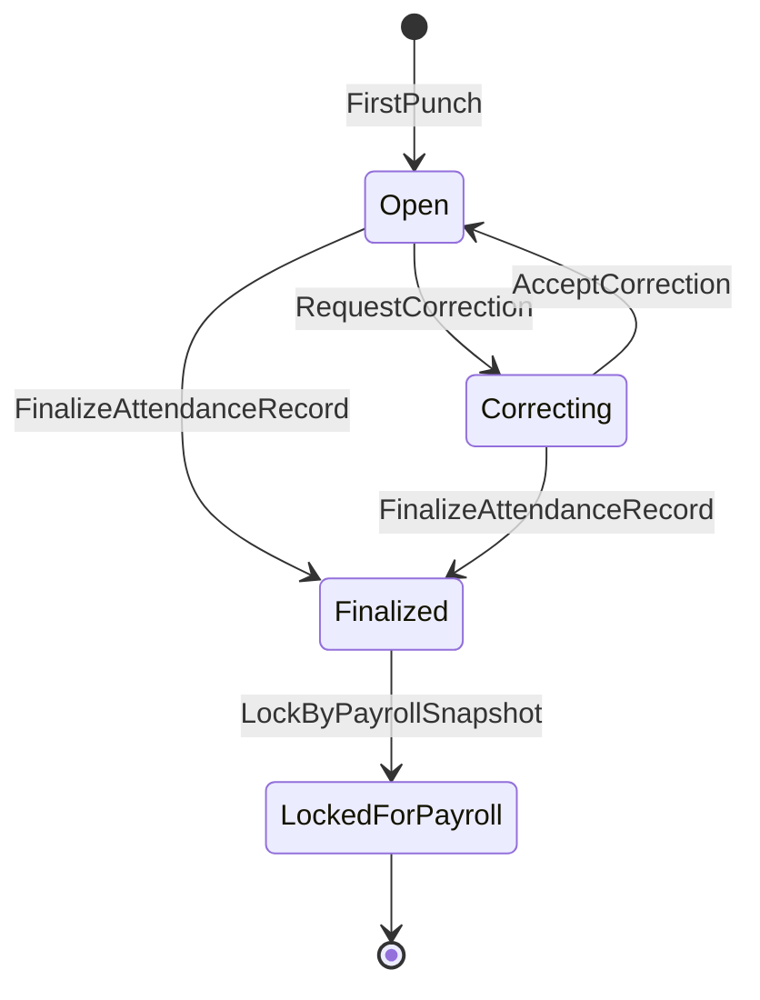

# Attendance Domain

## 責任範圍
- 打卡、工作日出勤紀錄、異常、校正、結算。
- 對外提供 finalized attendance result / summary。

## 不負責的事項
- 員工角色真相。
- 請假審批。
- 最終薪資結果。

## Aggregate / Entity / Value Object
| 類型 | 模型 |
| --- | --- |
| Aggregate | `AttendanceRecord` |
| Entity | `Punch`, `AttendanceAnomaly` |
| Value Object | `WorkDate`, `WorkInterval`, `CorrectionReason`, `AttendanceStatus` |

## 主要狀態機

## Domain Events
- `AttendanceClockedIn`
- `AttendanceClockedOut`
- `AttendanceCorrectionRequested`
- `AttendanceCorrected`
- `AttendanceFinalized`
- `AttendanceLockedForPayroll`

## 與其他 Context 的協作
| 對象 | 協作方式 |
| --- | --- |
| `Employee` | 讀取有效員工與排班 / scope snapshot |
| `Leave` | 套用 approved leave result 以消除異常或計算摘要 |
| `Payroll` | 輸出 `FinalizedAttendanceSummary`，不回寫 payroll 狀態 |
| `Audit` | 透過 `AuditPort` 或事件記錄補登、覆寫、敏感檢視 |

## 公開契約
- `FinalizedAttendanceSummary`：只由 Finalized 紀錄建立；包含版本，供 Payroll 使用。
