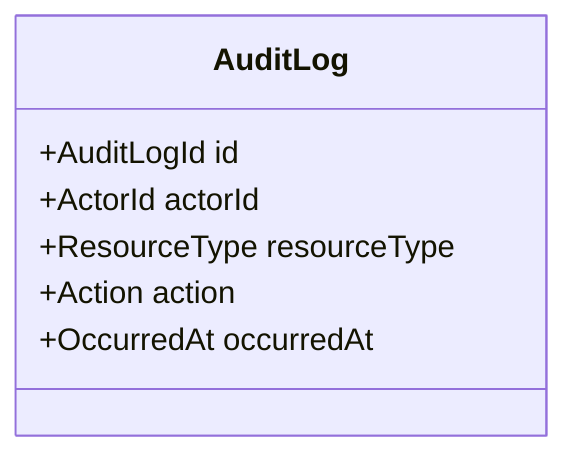

# Audit Log Domain

## 目的
- 定義可追溯的操作紀錄。

## 圖解

## 規則
- 重要操作需留下 actor、action、target、timestamp。
- Audit log 不應由 Client Component 直接寫入。

## 範例
- 核准請假後寫入一筆 approval audit event。

## 維護注意事項
- 只記錄追溯必需欄位，避免膨脹。
