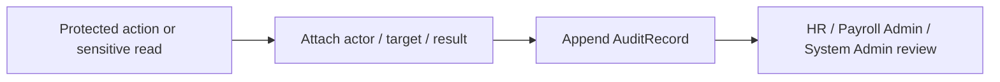

# Audit Log Capability

## 責任範圍
- 保存重要操作、敏感讀取、override、匯出與權限變更事件。
- 作為跨 Context 的安全與稽核能力。

## 不負責的事項
- 取代原始 Domain aggregate。
- 成為一般業務查詢列表的主要來源。
- 由 Client Component 直接建立或覆寫。

## Aggregate / Entity / Value Object 候選
| 類型 | 候選 |
| --- | --- |
| Aggregate | `AuditRecord` |
| Entity | `AuditMetadataEntry` |
| Value Object | `AuditAction`, `AuditResult`, `TargetRef`, `OccurredAt` |

## 主要流程

## Domain Event 候選
- `AuditRecordAppended`
- `SensitiveDataViewed`
- `PayrollExportRequested`
- `PermissionChanged`
- `PolicyDenied`

## 與其他 Context 的協作
| 對象 | 協作方式 |
| --- | --- |
| 全部 Context | 接收事實事件或 server-side audit port 呼叫 |
| `Security` | 套用遮罩、保存期限、匯出限制 |
| `Payroll` | 記錄 run / publish / export |
| `Employee` | 記錄角色、capability、manager 異動 |
