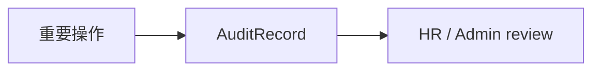

# Audit Log Capability

## 目的
- 說明稽核紀錄是 cross-cutting capability，而不是任意被其他 Context 直接覆寫的附屬欄位。

## 圖解

## 規則
- 稽核事件至少記錄 actor、action、target、occurredAt、result。
- 稽核紀錄只能追加，不可由 Client Component 直接寫入或覆寫。
- 其他 Context 只發布事實；是否與如何保存 audit record 由安全 / infrastructure 邊界控制。

## 範例
- 權限變更、薪資結算、請假 override 與敏感資料檢視都應留下稽核事件。

## 維護注意事項
- 欄位、保存期限與遮罩規則變更時，請同步更新 `docs/07-security/` 與 `docs/04-infrastructure/`。
