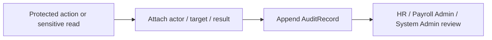

# Audit Log Capability

## 責任範圍
- 保存重要操作、敏感讀取、override、匯出與權限變更事件。
- 作為跨 Context 的安全與稽核能力。

## 不負責的事項
- 取代原始 Domain aggregate。
- 成為一般業務查詢列表的主要來源。
- 由 Client Component 直接建立或覆寫。

## Aggregate / Entity / Value Object
| 類型 | 模型 |
| --- | --- |
| Aggregate | `AuditRecord` |
| Entity | `AuditMetadataEntry` |
| Value Object | `AuditAction`, `AuditResult`, `TargetRef`, `OccurredAt` |

## 主要流程

## Domain Events
- `AuditRecordAppended`
- `SensitiveDataViewed`
- `PayrollExportRequested`
- `PermissionChanged`
- `PolicyDenied`

## 與其他 Context 的協作
| 對象 | 協作方式 |
| --- | --- |
| 全部 Context | 接收事實事件或 server-side audit port 呼叫 |
| Security Policy | 規定遮罩、保存期限與匯出限制；不是上游 Context |
| `Payroll` | 記錄 run / publish / export |
| `Employee` | 記錄角色、capability、manager 異動 |

## 公開契約
- `AppendAuditRecord`：各 Context 提交的最小 application command。
- `AuditFactRecorded`：來源 Context 透過 local outbox 發布，Audit 依 `eventId` 冪等接收。
- Audit 只 append，不提供覆寫或刪除來源事實的能力。
