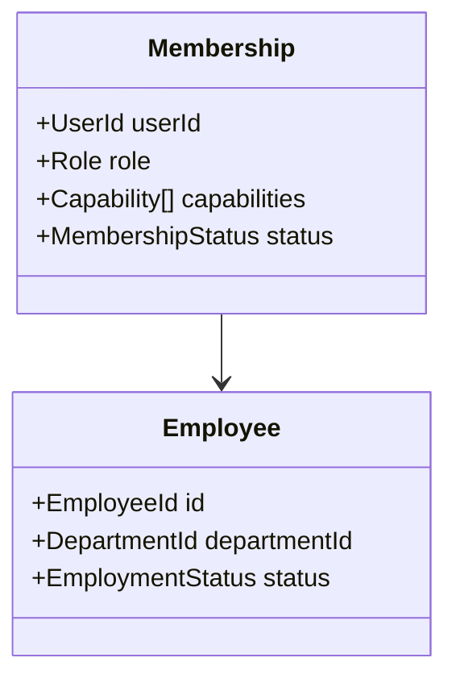

# Employee Domain

## 目的
- 定義員工主檔、membership 與 capability 的核心語意。

## 圖解

## 規則
- `Employee` 是出勤、請假、加班、薪資流程的身分來源。
- `Membership` 或對應 snapshot 才能回答 actor 在組織中的角色與 capability。
- `inactive` 任職或 membership 不得執行敏感 command。
- 角色、部門、主管與 capability 變更需留下稽核軌跡。

## 範例
- 離職員工不可再建立新的 `AttendanceRecord` 或 `LeaveRequest`。

## 維護注意事項
- 不要把 Firebase user、Firestore document 欄位或 client session 直接當成 Domain 定義。
