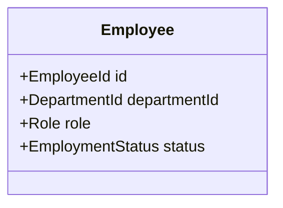

# Employee Domain

## 目的
- 定義員工主檔核心模型。

## 圖解

```mermaid
classDiagram
  class Employee {
    +EmployeeId id
    +DepartmentId departmentId
    +Role role
    +EmploymentStatus status
  }
```

## 規則
- Employee 是其他 HR 流程的身份來源。
- 角色與部門變更需保留稽核軌跡。

## 範例
- 離職員工不可再建立新的打卡紀錄。

## 維護注意事項
- 避免把 Firebase document 欄位直接當成 domain 定義。
