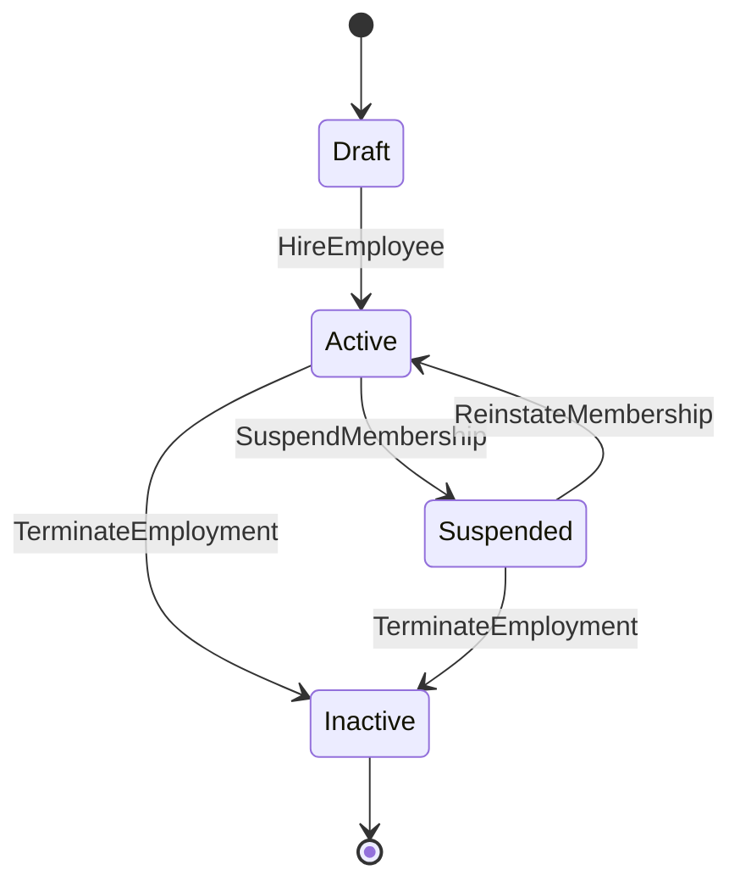

# Employee Domain

## 責任範圍
- 員工主檔。
- membership、角色、capability、任職狀態 snapshot。
- 提供其他 Context 所需的 identity / scope 真相來源。

## 不負責的事項
- 打卡流程。
- 請假與加班狀態機。
- 薪資結算。

## Aggregate / Entity / Value Object 候選
| 類型 | 候選 |
| --- | --- |
| Aggregate | `Employee`, `Membership` |
| Entity | `SupervisorAssignment`, `DepartmentAssignment` |
| Value Object | `EmployeeId`, `DepartmentId`, `EmploymentStatus`, `CapabilitySet` |

## 主要狀態機

## Domain Event 候選
- `EmployeeHired`
- `EmployeeProfileUpdated`
- `MembershipActivated`
- `MembershipSuspended`
- `EmployeeTerminated`
- `CapabilityChanged`

## 與其他 Context 的協作
| 對象 | 協作方式 |
| --- | --- |
| `Attendance` | 提供可打卡身份與 employment snapshot |
| `Leave` | 提供申請人身份、主管、額度相關 scope |
| `Approval` | 提供 approver / delegate 解析所需 membership |
| `Payroll` | 提供 payroll snapshot、在職狀態 |
| `Audit / Security` | 記錄角色、capability、主管異動 |
