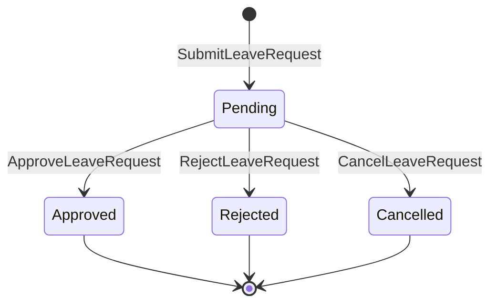

# Leave Domain

## 目的
- 定義請假申請的核心狀態、規則與與其他流程的協作邊界。

## 圖解

## 規則
- `LeaveRequest` 是一致性邊界；狀態只能由具語意的 domain 行為改變。
- 申請人不得核准自己的假單；override 流程必須可追溯。
- 已核准請假只公開結果給 Attendance / Payroll 消費，不共享內部狀態。
- `approved`、`rejected`、`cancelled` 皆為終止狀態，不可互相轉換。

## 範例
- 超過可用額度、期間非法或缺少 approver 的申請應被拒絕或阻擋送出。

## 維護注意事項
- 新增假別、額度或撤銷已核准假單規則前，先更新 use case、ports 與 security 文件。
