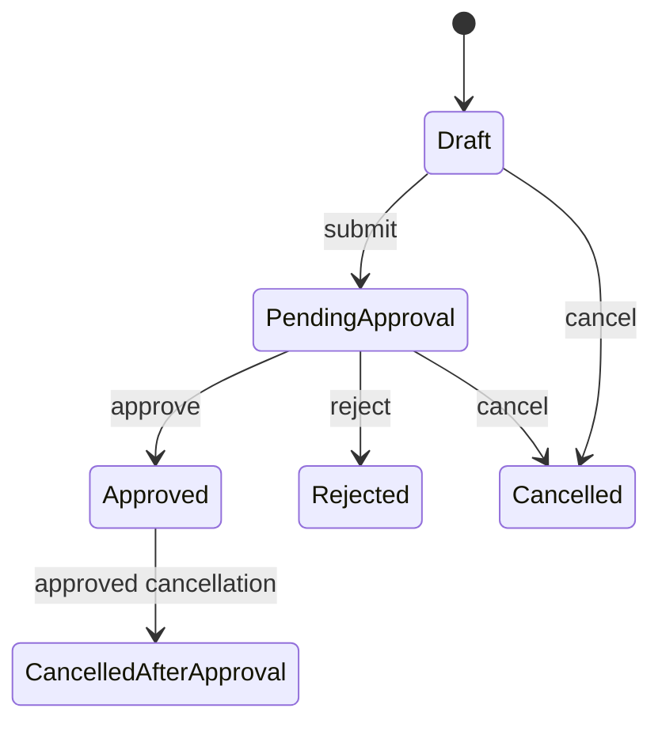

# Leave Domain

## 邊界
| 負責 | 不負責 |
| --- | --- |
| LeaveType、LeaveRequest、LeaveBalance、扣抵／返還／調整 | approver 真相、排班、原始 Punch、Payroll 計算 |

## 模型
| 類型 | 模型 |
| --- | --- |
| Aggregates | `LeaveType`, `LeaveRequest`, `LeaveBalance` |
| Entity / VO | `LeaveBalanceEntry`, `LeavePeriod`, `LeaveUnit`, `LeaveStatus` |
| Domain Event | `LeaveTypeRevised`, `LeaveRequestSubmitted`, `LeaveRequestApproved`, `LeaveRequestRejected`, `LeaveBalanceAdjusted`, `CompensatoryLeaveGranted` |
| Public contract | `ApprovedLeaveSummary`, `LeaveBalanceSummary` |
| Ports | `LeaveTypeRepository`, `LeaveRequestRepository`, `LeaveBalanceRepository`, 對應 Query Ports |

## 狀態

## 規則
- LeaveType 由 Leave 擁有並以 effective period／version 演進，不放入中央 System Settings。
- 決策前查詢 `ApprovalAssignmentResult`；Approval 不直接改寫 LeaveRequest。
- Overtime 的 `CompensatoryLeaveGranted` 依 `tenantId + eventId` 冪等建立 balance entry。
