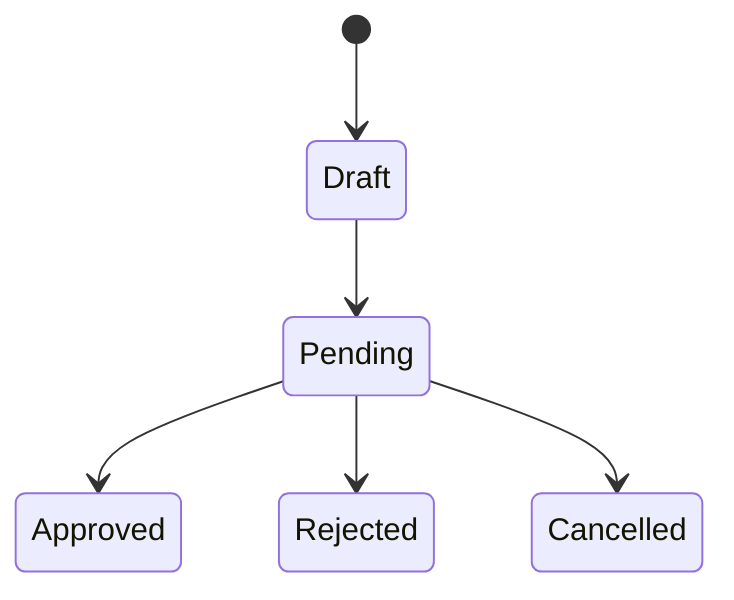

# Leave Domain

## 目的
- 定義請假申請與額度規則。

## 圖解

```mermaid
stateDiagram-v2
  [*] --> Draft
  Draft --> Pending
  Pending --> Approved
  Pending --> Rejected
  Pending --> Cancelled
```

## 規則
- 請假送出後需經審批才生效。
- 已核准請假會影響出勤與薪資計算。

## 範例
- 超過剩餘額度的申請應被拒絕。

## 維護注意事項
- 假別與額度可再拆成 value object。
