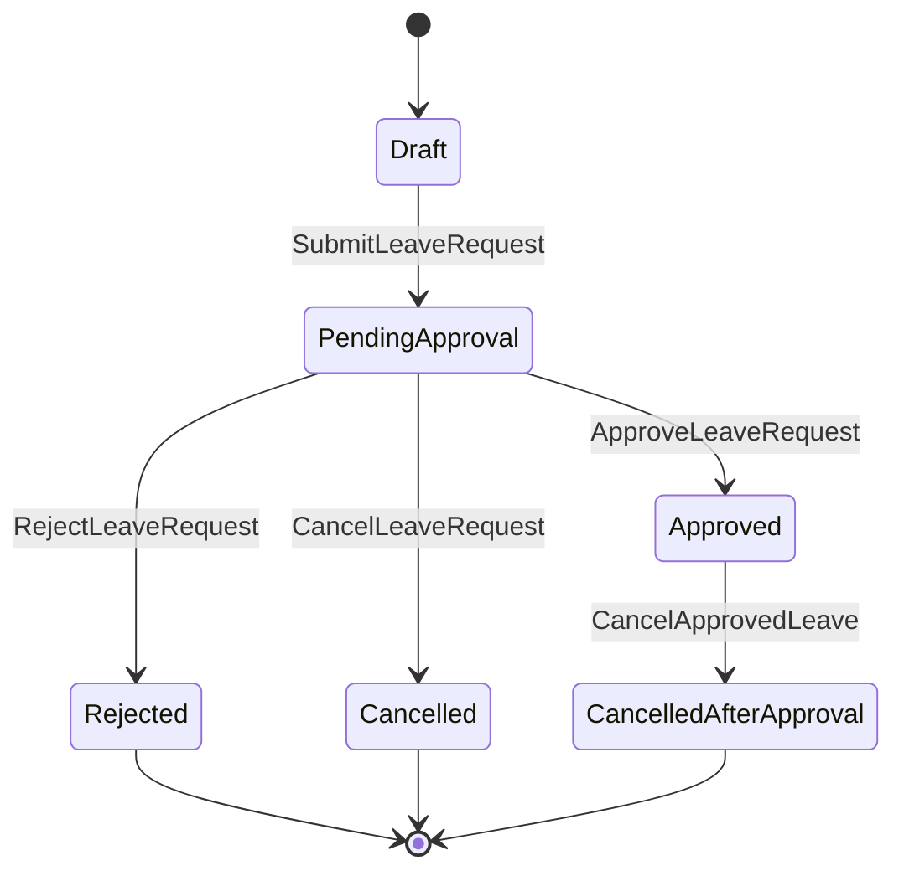

# Leave Domain

## 責任範圍
- 請假申請、額度消耗、送審、核准、駁回、取消。
- 對外提供 approved leave result / period summary。

## 不負責的事項
- approver 真相來源。
- 出勤原始 punch。
- 薪資發放。

## Aggregate / Entity / Value Object 候選
| 類型 | 候選 |
| --- | --- |
| Aggregate | `LeaveRequest` |
| Entity | `LeaveApprovalRecord`, `LeaveBalanceLedger` |
| Value Object | `LeaveType`, `LeavePeriod`, `LeaveStatus`, `LeaveReason` |

## 主要狀態機

## Domain Event 候選
- `LeaveRequestSubmitted`
- `LeaveRequestApproved`
- `LeaveRequestRejected`
- `LeaveRequestCancelled`
- `LeaveBalanceConsumed`
- `LeaveOverrideApplied`

## 與其他 Context 的協作
| 對象 | 協作方式 |
| --- | --- |
| `Employee` | 取得身份、部門、主管與額度 scope |
| `Approval` | 解析 approver 與指派責任 |
| `Attendance` | 輸出核准結果供出勤套用 |
| `Payroll` | 輸出已核准假別與期間摘要 |
| `Audit / Security` | 記錄 override、理由、敏感查閱 |
