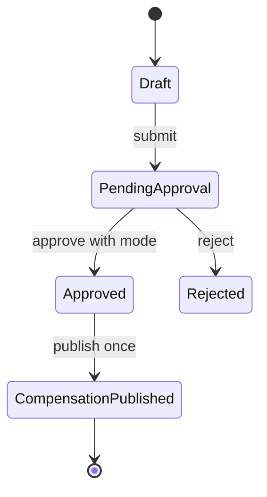

# Overtime Domain

## 邊界
| 負責 | 不負責 |
| --- | --- |
| 加班申請、核定、CompensationMode、發布補償結果 | 原始 Punch、approver 真相、假額度、薪資公式 |

## 模型
| 類型 | 模型 |
| --- | --- |
| Aggregate | `OvertimeRequest` |
| Entity / VO | `CompensationDecision`, `OvertimePeriod`, `CompensationMode`, `OvertimeStatus` |
| Domain Event | `OvertimeRequestSubmitted`, `OvertimeRequestApproved`, `OvertimeRequestRejected`, `OvertimeCompensationPublished` |
| Public contract | `OvertimeAdjustment`, `CompensatoryLeaveGranted` integration event |
| Ports | `OvertimeRequestRepository`, `OvertimeAdjustmentQueryPort` |

## 狀態

## 協作
- 以 WorkScheduleSnapshot 與 FinalizedAttendanceSummary 驗證期間，不讀取 Schedule／Attendance Aggregate。
- `Payroll` 模式發布 `OvertimeAdjustment`；`CompensatoryLeave` 模式發布版本化事件給 Leave。
- consumer 先採同程序處理並冪等；目前不要求 broker 或 Outbox。
