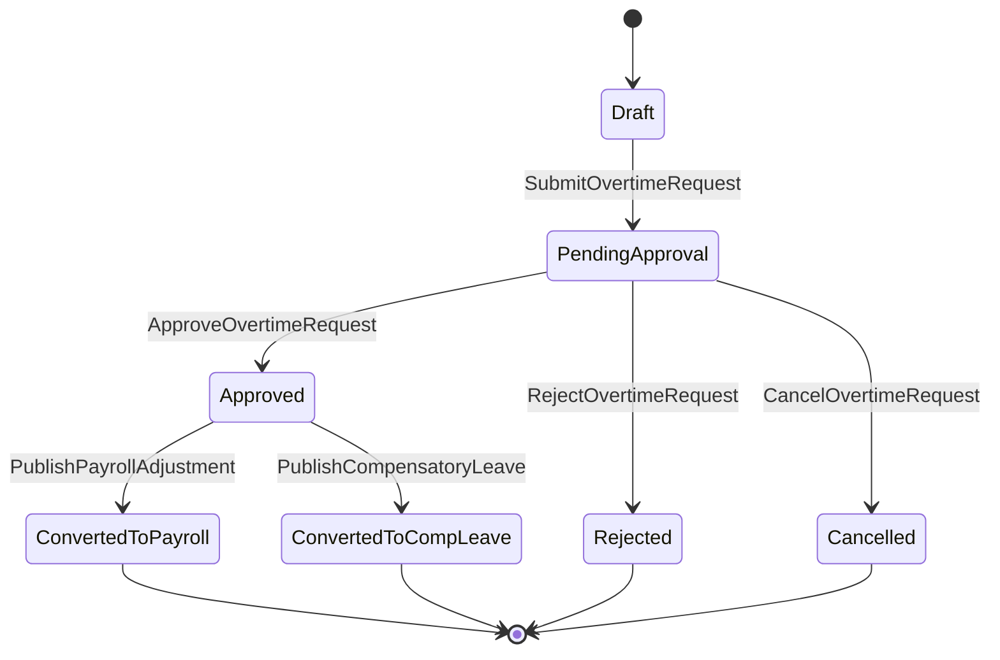

# Overtime Domain

## 責任範圍
- 加班申請、送審、核定、補償模式、公開調整結果。
- 對外提供補休或薪資調整結果。

## 不負責的事項
- 原始出勤 punch 真相。
- approver 真相來源。
- 薪資主檔與發薪流程。

## Aggregate / Entity / Value Object 候選
| 類型 | 候選 |
| --- | --- |
| Aggregate | `OvertimeRequest` |
| Entity | `CompensationDecision`, `OvertimeApprovalRecord` |
| Value Object | `OvertimePeriod`, `CompensationMode`, `OvertimeStatus`, `OvertimeReason` |

## 主要狀態機

## Domain Event 候選
- `OvertimeRequestSubmitted`
- `OvertimeRequestApproved`
- `OvertimeRequestRejected`
- `OvertimeRequestCancelled`
- `OvertimeConvertedToPayroll`
- `OvertimeConvertedToCompensatoryLeave`

## 與其他 Context 的協作
| 對象 | 協作方式 |
| --- | --- |
| `Employee` | 取得身份與可申請 scope |
| `Attendance` | 取得佐證摘要，不直接共用 punch model |
| `Approval` | approver resolution |
| `Payroll` | 提供薪資調整結果 |
| `Leave` | 提供補休來源結果 |
| `Audit / Security` | 記錄補償模式與 override |
