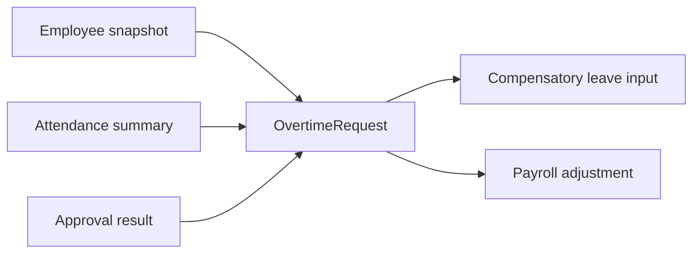

# Overtime Domain

## 目的
- 定義加班申請、補償模式與與請假 / 薪資的協作邊界。

## 圖解

## 規則
- `OvertimeRequest` 擁有加班申請與補償結果語意，不擁有出勤原始 punch 或薪資結算本身。
- 補休額度若由加班產生，來源真相必須留在 Overtime 或其公開契約，不可由 Leave 自行推算。
- 加班費與補休屬敏感結果，需由 server-side 流程決定與記錄。

## 範例
- 同一筆加班申請不能同時被標記為已轉薪資又已轉補休。

## 維護注意事項
- 若第一版尚未完成完整加班計算，至少先維持申請、審批與公開契約邊界清楚。
